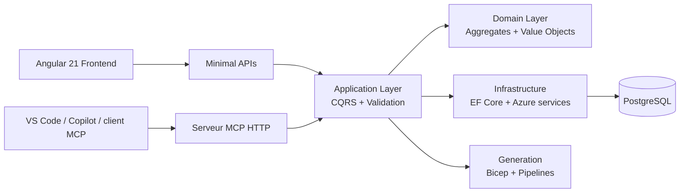

<div align="center">
  <h1>InfraFlowSculptor</h1>
  <p><strong>Plateforme de modélisation d'infrastructure Azure.</strong></p>
  <p>Modéliser l'infrastructure comme un domaine métier, garder une source de vérité unique, puis générer du Bicep, des assets de delivery Azure DevOps et des workflows MCP à partir du même cœur applicatif.</p>
</div>

<p align="center">
  
  
  
  
  
  
</p>

<p align="center">
  <a href="#overview">Vue d'ensemble</a> ·
  <a href="#capabilities">Capacités</a> ·
  <a href="#architecture">Architecture</a> ·
  <a href="#tech-foundation">Socle technique</a> ·
  <a href="#quick-start">Démarrage rapide</a> ·
  <a href="#mcp">MCP</a> ·
  <a href="#repo-structure">Structure du dépôt</a> ·
  <a href="#documentation">Documentation</a> ·
  <a href="#license">Licence</a>
</p>

| Positionnement | Sorties générées | Surfaces exposées | Licence |
|---|---|---|---|
| Source de vérité d'infrastructure Azure | Bicep, pipelines Azure DevOps, bootstrap et artefacts de configuration | Front Angular, Minimal APIs .NET, serveur MCP HTTP | PolyForm Noncommercial 1.0.0 |

> InfraFlowSculptor n'est pas un pack de templates. Le dépôt porte un modèle métier, des règles de validation, une persistance PostgreSQL, des moteurs de génération spécialisés, une interface Angular, un serveur MCP et une orchestration locale Aspire autour du même cœur applicatif.

<a id="overview"></a>
## Vue d'ensemble

Les plateformes cloud finissent souvent décrites à plusieurs endroits en même temps : fichiers IaC dupliqués, conventions de nommage implicites, scripts ad hoc, règles de validation éparpillées et faible traçabilité des choix d'architecture.

InfraFlowSculptor prend le problème à l'envers : l'infrastructure est d'abord modélisée comme un domaine applicatif, puis les artefacts techniques sont produits depuis cette source de vérité. Le frontend, l'API et le serveur MCP s'appuient donc sur les mêmes règles métier, la même validation, les mêmes services d'infrastructure et les mêmes moteurs de génération.

Le périmètre couvre déjà un ensemble significatif de ressources Azure et de scénarios projet : Key Vault, Storage Account, App Service Plan, Web App, Function App, Container Apps, SQL Server, SQL Database, Cosmos DB, Service Bus, Event Hub, Redis, ACR, Application Insights, Log Analytics, User Assigned Identity, App Configuration, templates de nommage, paramètres d'environnement, références cross-config et génération d'artefacts de delivery.

<a id="capabilities"></a>
## Capacités clés

| Axe | Ce que le produit couvre |
|---|---|
| Modélisation | Projets, configurations, environnements, ressources Azure, conventions de nommage, dépendances et références cross-config |
| Génération IaC | Production de Bicep à partir du modèle métier |
| Delivery | Génération d'assets Azure DevOps pour pipelines et bootstrap |
| MCP | Workflow `draft -> validation -> création`, import IaC, génération Bicep, configuration post-création |
| Exploitation locale | Stack complet orchestré par .NET Aspire |

<a id="architecture"></a>
## Architecture

Le principe directeur est simple : les surfaces d'entrée changent, le cœur applicatif reste le même.



### Découpage principal

| Zone | Rôle |
|---|---|
| `src/Api` | API, Application, Domain, Infrastructure, Contracts et moteurs de génération |
| `src/Front` | Application Angular et expérience utilisateur |
| `src/Mcp` | Serveur MCP HTTP exposé sur `/mcp` |
| `src/Aspire` | AppHost de développement local et câblage des services |
| `tests` | Suites xUnit par assembly cible |
| `docs` | Documentation d'architecture, d'Azure et des features |

### Ce que l'AppHost lance en local

- PostgreSQL
- DbGate
- l'API principale
- le frontend Angular
- le service MCP HTTP
- les services utilitaires de stockage utilisés par la génération

<a id="tech-foundation"></a>
## Socle technique

| Domaine | Choix |
|---|---|
| Backend | .NET 10, ASP.NET Core Minimal APIs |
| Architecture applicative | MediatR, CQRS, FluentValidation, Mapster |
| Domaine et persistance | DDD, EF Core, PostgreSQL |
| Frontend | Angular 21 standalone, Angular Material, Tailwind CSS, Axios |
| Authentification applicative | Microsoft Entra ID / JWT Bearer |
| Authentification MCP | PAT interne `ifs_...` |
| Orchestration locale | .NET Aspire |
| Tests | xUnit, projets dédiés sous `tests/` |

<a id="quick-start"></a>
## Démarrage rapide

Les commandes ci-dessous correspondent aux commandes documentées et utilisées dans le dépôt.

### Prérequis

- .NET SDK `10.0.100`
- Node.js pour le frontend Angular
- Docker ou un environnement compatible avec l'exécution locale orchestrée par Aspire

### Construire et lancer le stack complet

```pwsh
dotnet build .\InfraFlowSculptor.slnx
dotnet run --project .\src\Aspire\InfraFlowSculptor.AppHost\InfraFlowSculptor.AppHost.csproj
```

### Travailler sur le frontend

```pwsh
Set-Location .\src\Front
npm install
npm run start
npm run build
npm run typecheck
```

### Exécuter les tests

```pwsh
dotnet test .\InfraFlowSculptor.slnx
```

### Construire uniquement l'API

```pwsh
dotnet build .\src\Api\InfraFlowSculptor.Api\InfraFlowSculptor.Api.csproj
```

<a id="mcp"></a>
## MCP

InfraFlowSculptor expose un serveur Model Context Protocol pour connecter un client IA aux capacités métier du produit sans dupliquer la logique applicative.

| Élément | Valeur |
|---|---|
| Endpoint | `/mcp` |
| URL locale par défaut | `http://127.0.0.1:5258/mcp` |
| Hébergement local | Service HTTP lancé avec l'AppHost Aspire |
| Authentification | `Authorization: Bearer ifs_...` |
| Flux principaux | draft de projet, validation, création, import IaC, génération Bicep, configuration post-création |

Le flux MCP est volontairement orienté métier plutôt que transport :

```text
prompt libre -> draft structuré -> validation -> création du projet -> génération / configuration
```

### Exemple de configuration VS Code

```json
{
  "servers": {
    "infraflowsculptor-mcp": {
      "type": "http",
      "url": "http://127.0.0.1:5258/mcp",
      "headers": {
        "Authorization": "Bearer ${input:ifs_pat}"
      }
    }
  }
}
```

### Exemples de demandes utiles

- `crée un draft de projet avec Key Vault, Container App et SQL Server`
- `valide le draft et liste les clarifications manquantes`
- `génère le Bicep du projet <id>`
- `configure le naming template du projet <id>`
- `ajoute un app setting sur la Container App <resourceId>`

Pour l'architecture runtime, l'authentification PAT et l'inventaire exact des capacités MCP, voir [docs/architecture/mcp-integration.md](docs/architecture/mcp-integration.md).

<a id="repo-structure"></a>
## Structure du dépôt

```text
src/
├── Api/        API, Application, Domain, Infrastructure, Contracts, GenerationCore, Bicep, Pipeline
├── Front/      Frontend Angular
├── Mcp/        Serveur MCP HTTP
└── Aspire/     AppHost et orchestration locale

tests/          Projets xUnit par assembly
docs/           Documentation technique et fonctionnelle
scripts/        Automatisation et maintenance
audits/         Audits techniques du dépôt
```

<a id="documentation"></a>
## Documentation

### Parcours de lecture recommandé

1. [docs/architecture/overview.md](docs/architecture/overview.md) pour la structure globale.
2. [docs/architecture/ddd-concepts.md](docs/architecture/ddd-concepts.md) pour le modèle métier.
3. [docs/architecture/cqrs-patterns.md](docs/architecture/cqrs-patterns.md) pour les flux applicatifs.
4. [docs/architecture/bicep-generation.md](docs/architecture/bicep-generation.md) pour le moteur de génération IaC.
5. [docs/architecture/pipeline-generation.md](docs/architecture/pipeline-generation.md) pour la génération d'assets de delivery.
6. [docs/architecture/mcp-integration.md](docs/architecture/mcp-integration.md) pour le serveur MCP, le runtime HTTP et l'authentification PAT.

### Index documentaire

- [docs/README.md](docs/README.md)
- [docs/architecture/getting-started.md](docs/architecture/getting-started.md)
- [docs/azure/README.md](docs/azure/README.md)
- [docs/features/push-bicep-to-git.md](docs/features/push-bicep-to-git.md)
- [docs/features/cross-config-references.md](docs/features/cross-config-references.md)

<a id="license"></a>
## Licence

Ce dépôt est distribué sous [PolyForm Noncommercial 1.0.0](LICENSE).

Le code reste public pour lecture, évaluation et usage non commercial. Toute utilisation commerciale, intégration dans une offre payante, exploitation pour un client ou usage interne à finalité commerciale nécessite un accord séparé avec l'auteur.