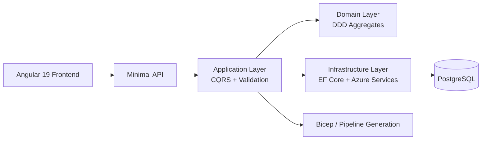

# Infra Flow Sculptor

<p align="center">
	<strong>Plateforme de modélisation d'infrastructure Azure avec génération automatique de Bicep et d'assets de delivery.</strong>
</p>

<p align="center">
	Concevoir une infrastructure comme un modèle métier, appliquer des conventions cohérentes, puis produire des artefacts prêts à industrialiser.
</p>

<p align="center">
	
	
	
	
	
</p>

---

## Vision

**Infra Flow Sculptor** répond à un problème classique des plateformes cloud : la configuration d'infrastructure est souvent dispersée entre conventions implicites, fichiers IaC dupliqués, scripts ad hoc et décisions d'architecture peu traçables.

L'objectif du projet est de fournir une **source de vérité applicative** pour décrire une infrastructure Azure, ses environnements, ses règles de nommage et ses dépendances, puis de **générer automatiquement** les artefacts techniques nécessaires.

En pratique, le dépôt met en avant un travail full stack structuré autour de trois axes :

- **Modéliser** l'infrastructure avec une approche DDD explicite
- **Orchestrer** les règles métier via CQRS, validation et persistance robuste
- **Générer** des sorties exploitables pour Azure et les workflows de delivery

---

## Ce Que Le Projet Fait

- Modélisation de configurations d'infrastructure Azure multi-environnements
- Gestion de conventions de nommage, paramètres, dépendances et références cross-config
- Génération automatique de fichiers **Bicep** à partir du modèle métier
- Génération d'assets de **pipelines Azure DevOps** pour industrialiser le delivery
- Gestion d'un large spectre de ressources Azure : Key Vault, Storage Account, App Service Plan, Web App, Function App, Container App, Container App Environment, SQL Server, SQL Database, Cosmos DB, Service Bus, Event Hub, Redis, ACR, Application Insights, Log Analytics, User Assigned Identity, App Configuration, et plus encore
- API unifiée exposée en **Minimal APIs**, consommée par un frontend **Angular 19**

---

## Pourquoi Le Dépôt Est Solide Techniquement

- **DDD réel, pas cosmétique** : agrégats, entités, value objects, invariants et erreurs métier dédiées
- **CQRS propre** : commandes, queries, handlers, validators et pipeline behaviors clairement séparés
- **Architecture propre** : Domain, Application, Infrastructure, Contracts et API sont explicitement découplés
- **Génération spécialisée** : le moteur de génération Bicep est isolé dans un projet dédié, indépendant du domaine
- **Persistance maîtrisée** : EF Core, PostgreSQL, mapping structuré, Unit of Work et repository pattern
- **Auth et sécurité** : Microsoft Entra ID, JWT Bearer, politiques d'autorisation et contexte utilisateur courant
- **Expérience locale sérieuse** : orchestration via .NET Aspire pour lancer l'ensemble du stack
- **Documentation versionnée** : architecture, DDD, CQRS, persistance et conventions sont documentés dans le repo

---

## Architecture



### Découpage de la solution

| Couche | Responsabilité principale |
|--------|---------------------------|
| `InfraFlowSculptor.Api` | Endpoints Minimal API, mapping, DI, erreurs, configuration HTTP |
| `InfraFlowSculptor.Application` | Use cases CQRS, validation, orchestration métier, interfaces |
| `InfraFlowSculptor.Domain` | Agrégats, entités, value objects, invariants, erreurs métier |
| `InfraFlowSculptor.Infrastructure` | EF Core, repositories, auth, intégrations Azure, implémentations techniques |
| `InfraFlowSculptor.Contracts` | DTOs request/response partagés entre API et frontend |
| `InfraFlowSculptor.BicepGeneration` | Moteur de génération Bicep découplé du domaine |
| `InfraFlowSculptor.PipelineGeneration` | Génération de pipelines Azure DevOps |
| `Front` | Interface Angular 19, expérience utilisateur et consommation API |
| `Aspire` | Orchestration locale du stack |

---

## Stack Technique

| Domaine | Choix |
|--------|-------|
| Backend | .NET 10, ASP.NET Core Minimal APIs |
| Architecture applicative | DDD, CQRS, MediatR |
| Validation | FluentValidation |
| Mapping | Mapster |
| Persistance | EF Core + PostgreSQL |
| Gestion des résultats | ErrorOr |
| Frontend | Angular 19, Angular Material, Tailwind CSS, Axios |
| Authentification | Microsoft Entra ID / JWT Bearer |
| Orchestration locale | .NET Aspire |
| Gestion des packages | Central Package Management |

---

## Démarrage Rapide

### Prérequis

- .NET SDK `10.0.100`
- Node.js pour le frontend Angular
- Un environnement local compatible avec PostgreSQL via Aspire

### Lancer le projet en local

```pwsh
dotnet build .\InfraFlowSculptor.slnx
dotnet run --project .\src\Aspire\InfraFlowSculptor.AppHost\InfraFlowSculptor.AppHost.csproj
```

### Lancer le frontend seul

```pwsh
Set-Location .\src\Front
npm install
npm run start
```

### Construire uniquement l'API

```pwsh
dotnet build .\src\Api\InfraFlowSculptor.Api\InfraFlowSculptor.Api.csproj
```

---

## Documentation

- [Documentation technique](docs/README.md)
- [Vue d'ensemble de l'architecture](docs/architecture/overview.md)
- [DDD et concepts métier](docs/architecture/ddd-concepts.md)
- [CQRS et MediatR](docs/architecture/cqrs-patterns.md)
- [Persistance EF Core](docs/architecture/persistence.md)
- [Génération Bicep](docs/architecture/bicep-generation.md)
- [Génération de pipelines](docs/architecture/pipeline-generation.md)

---

## Structure Du Dépôt

```text
src/
├── Api/       API, domaine, application, infrastructure, contracts, génération
├── Front/     Application Angular
└── Aspire/    AppHost et defaults partagés

docs/          Documentation technique et fonctionnelle
scripts/       Scripts d'automatisation
audits/        Audits du dépôt et historique qualité
```

---

## Ce Que Ce Repo Met En Avant

Ce dépôt n'est pas seulement une démo d'interface ou un générateur de templates. Il montre un travail d'ingénierie cohérent sur l'ensemble de la chaîne :

- conception d'un modèle métier riche pour l'infrastructure cloud
- industrialisation de la génération d'artefacts Azure
- structuration propre d'une solution .NET moderne
- intégration d'un frontend Angular avec un backend fortement typé
- documentation, conventions et architecture pensées pour durer

Si l'objectif est d'évaluer la qualité du projet et la rigueur de l'implémentation, le meilleur point d'entrée reste la documentation d'architecture puis le découpage des couches dans `src/Api/`.

---

## Roadmap

- étendre encore la couverture des ressources Azure et des scénarios multi-environnements
- enrichir la génération de pipelines et les scénarios de delivery mono-repo
- poursuivre l'industrialisation autour de la gouvernance, de la validation et du push des artefacts générés

---

## Licence

Ce projet est distribué sous licence PolyForm Noncommercial 1.0.0, disponible dans [LICENSE](LICENSE).

Le code reste public pour consultation, apprentissage et évaluation technique, mais son usage est limité aux usages non commerciaux définis par cette licence.

Tout usage commercial, intégration dans une offre payante, exploitation pour un client ou usage interne à finalité commerciale nécessite un accord de licence commercial séparé avec l'auteur.