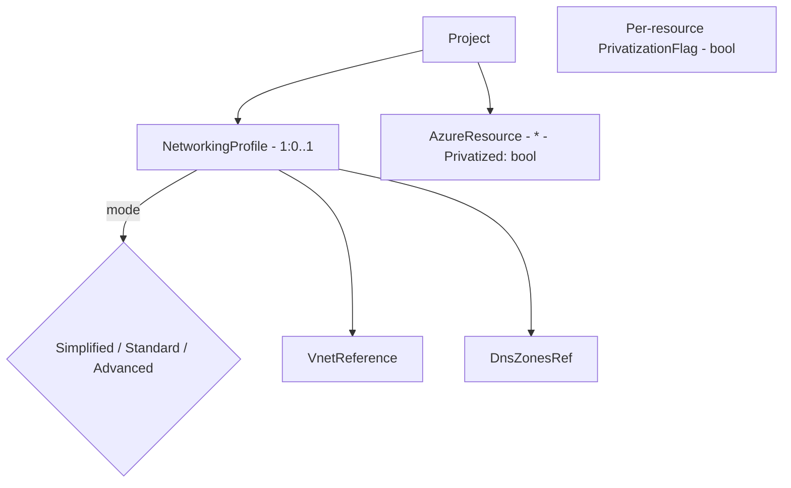

# Azure Privatization — Redesign Investigation

> **Auteur :** `@dev` (investigation cross-cutting)
> **Date :** 2026-05-28
> **Statut :** Investigation & design — pas d'implémentation dans cette passe
> **Référence externe :** `gpt4enterprise.socle.jesa/infrastructure/bicep`
> **Plan précédent :** [privatization-networking-plan.md](privatization-networking-plan.md) — partiellement implémenté, jugé insatisfaisant
> **Niveau de réflexion attendu :** Staff/Principal — vision produit + plateforme + UX + exploitation

---

## TL;DR exécutif

1. **L'implémentation actuelle est une coquille.** Le modèle de données (`PrivateEndpointConfig`, `VirtualNetwork`, `Subnet`, `PrivateDnsZone`, `FrontDoor`, `NetworkSecurityGroup`) existe en Domain + EF Core + CQRS + Frontend, **mais aucun stage du pipeline de génération Bicep ne traduit ces données en `module xxxPe '...' = { ... }` dans `main.bicep`.** Le `PrivateEndpointTypeBicepGenerator` produit un module réutilisable orphelin que personne n'instancie. La privatisation **n'existe pas réellement dans la sortie Bicep**.
2. **Le pattern actuel mélange deux philosophies incompatibles :** PE modélisé comme entité enfant sur chaque `AzureResource` (modèle "PE first-class côté IFS") **+** PE généré comme module réutilisable (modèle "companion per-resource côté Bicep"). Aucune des deux n'est menée jusqu'au bout.
3. **Le repo de référence (gpt4enterprise) suit un modèle radicalement plus simple :** un fichier `configuration/network.bicep` central qui résout VNet/Subnets existants et **produit une `networkConfiguration` typée par ressource consommatrice**. Chaque module métier (cosmos, storage, keyvault, …) accepte un paramètre `networkConfig` et délègue à son propre `private-resources.bicep` la création de PE + DNS zone + link. **C'est le pattern Azure idiomatique.**
4. **Le modèle de données actuel sur-modélise.** `PrivateDnsZone`, `VirtualNetworkLink`, `FrontDoor.Origins`, `NetworkSecurityGroup` exposés comme aggrégats first-class créent une charge UX et de maintenance disproportionnée par rapport à ce que 90 % des utilisateurs cherchent à faire (cocher "privatiser ce projet").
5. **Recommandation :** repartir d'une feuille **Networking Profile** unique par projet (niveau projet, pas niveau ressource), supprimer 60 % du code actuel, et produire un Bicep aligné sur Azure Verified Modules / Landing Zone idioms.

---

## 1. Analyse critique de l'existant

### 1.1. La génération Bicep ne génère pas la privatisation

**Constat factuel :**

| Couche | État actuel |
|---|---|
| Domain `PrivateEndpointConfig` sur `AzureResource` | ✅ Existe, persisté, repository chargé via `.Include(r => r.PrivateEndpointConfigs)` |
| CQRS Add/Update/Remove PE | ✅ Existe |
| Frontend `PrivateEndpointService` + onglet networking | ✅ Existe |
| `PrivateEndpointTypeBicepGenerator` | ✅ Génère un fichier module `modules/Common/privateEndpoint.bicep` |
| **Stage pipeline qui instancie `module kvPe 'modules/Common/privateEndpoint.bicep'` dans `main.bicep`** | ❌ **N'existe pas** |
| `main.bicep` émis | Contient le module métier de la ressource cible **sans PE companion** |
| `publicNetworkAccess: Disabled` injecté dans les modules métier | ❌ Non implémenté de bout en bout (seul `ContainerRegistry` a la propriété domain) |
| DNS zones liées au VNet | ❌ Pas générées |

**Conséquence :** un utilisateur qui configure un PE dans l'UI obtient une sauvegarde DB mais un Bicep **sans PE**. C'est une fausse fonctionnalité — pire qu'aucune, parce qu'elle promet ce qu'elle ne livre pas.

### 1.2. Dispersion architecturale du modèle

L'option retenue dans le plan d'origine : "`PrivateEndpointConfig` est une entité enfant de **chaque** `AzureResource`". Conséquences observables :

- **Le concept réseau est inversé.** Côté Azure, un PE est une **ressource indépendante** dans un RG, qui pointe vers (subnet + service cible). Côté IFS, il est devenu une propriété de la ressource cible. Cela complique la mutualisation (deux services qui doivent partager un PE → impossible) et le déplacement (PE dédié à un RG de networking partagé → impossible sans contorsion).
- **`PrivateEndpointConfig.GroupId` est une `string` libre** dans le domaine. Le catalogue `PrivateEndpointGroupIdCatalog` existe mais n'est pas branché en validateur d'invariant — un appelant peut créer un PE avec `GroupId = "foobar"` sans erreur. C'est un risque direct de Bicep cassé.
- **`PrivateEndpointGroupIdCatalog` utilise des clés `string` hardcodées** (`"KeyVault"`, `"StorageAccount"`) au lieu de référencer `AzureResourceTypes.*`. Couplage faible, erreur silencieuse si renommage.
- **`PrivateDnsZone` est un agrégat first-class avec CRUD complet.** Or 99 % du temps la DNS zone est dérivable du `GroupId` via `PrivateDnsZoneNameCatalog` (la table `privatelink.vaultcore.azure.net` est universelle). L'utilisateur n'a pas à la nommer ni à la gérer. C'est de la sur-modélisation.
- **`NetworkSecurityGroup` est un agrégat first-class avec `NsgRule` owned.** Idem : 90 % des projets n'écrivent jamais de règle NSG custom — le default Azure suffit pour PE inbound. Exposer ce niveau de détail dans l'UI noie l'utilisateur.
- **`FrontDoor` est dans le scope "privatisation".** C'est une erreur conceptuelle. Front Door = *exposition publique sécurisée*, pas privatisation. Il a sa place dans le produit mais pas dans cette feature.
- **`Subnet` est owned par `VirtualNetwork`** mais référencé par `Id` (string libre) depuis `PrivateEndpointConfig.SubnetId: AzureResourceId`. Aucune FK relationnelle EF — l'intégrité référentielle "ce PE pointe vers un subnet existant" n'est pas garantie en base.

### 1.3. UX

- L'utilisateur doit **manuellement** : créer un VNet, ajouter des subnets, créer une DNS zone par GroupId, créer un link VNet, créer un PE par ressource, choisir le GroupId, sélectionner le subnet. **6 étapes pour privatiser un Key Vault.** Sur un projet à 12 ressources : ~70 actions manuelles.
- Aucun preset, aucun mode "privatiser tout", aucune validation amont (SKU incompatible → erreur uniquement au déploiement Azure).
- L'onglet "Networking" est ajouté par ressource — l'utilisateur n'a pas de vue projet "voici ce qui est privatisé / ce qui ne l'est pas".

### 1.4. Sécurité & exploitation

- **`PublicNetworkAccess`** est ajouté côté domain *uniquement sur `ContainerRegistry`*. Les autres ressources privatisables (KV, Storage, Cosmos, …) n'ont pas le flag → un PE configuré n'entraîne **aucun** durcissement de l'accès public côté Azure. Privatisation = passoire.
- Aucune `networkAcls` (deny-all default) générée.
- Aucune politique de fallback de résolution DNS hub-and-spoke (cas enterprise courant).
- Aucune trace de gestion cross-subscription / cross-RG des Private DNS Zones (pattern enterprise standard : DNS zones mutualisées dans un RG `rg-network-shared`).

### 1.5. Bilan

L'existant représente **2-3 sprints de travail** ayant produit un modèle de données riche mais **non livrable**. Le coût de complétion (au pattern actuel) dépasse le coût de reconception. C'est le moment de raser.

---

## 2. Analyse du repository de référence (gpt4enterprise)

### 2.1. Architecture observée

```
bicep/
├── main.bicep                       # Orchestrateur
├── types.bicep                      # networkConfiguration, roleAssignment, …
├── naming-builder.bicep             # Naming générique
├── configuration/
│   └── network.bicep                # ⭐ Point central : résout VNet existant, produit
│                                    #   une networkConfiguration par ressource consommatrice
└── modules/
    ├── cosmosdb/
    │   ├── main.bicep               # Accepte param networkConfig: networkConfiguration
    │   ├── types.bicep              # Types locaux du module
    │   └── private-resources.bicep  # Companion : crée PE + DNS zone + link
    ├── storageaccount/
    │   ├── main.bicep
    │   └── private-resources.bicep  # 2 PE (blob + table) + 2 DNS zones
    ├── keyvault/
    │   ├── main.bicep               # ⚠️ Pas de PE ici — KV est traité ailleurs (sub-RG)
    │   └── secret.bicep
    └── …
```

### 2.2. Patterns clés

**A. Type partagé `networkConfiguration` (types.bicep)**

```bicep
type networkConfiguration = {
  deployPrivateEndpoint: bool
  publicNetworkAccess: 'Disabled' | 'Enabled'
  deployDnsZone: bool
  resourceGroupName: string
  privateEndpointVnetId: string
  privateEndpointVnetName: string
  privateEndpointSubnetName: string
  privateEndpointLocation: string
  ipAddress: array     // IPs statiques optionnelles via cidrHost()
}
```

→ **Une seule forme typée** circule de bout en bout. Chaque module consommateur a une signature uniforme.

**B. `configuration/network.bicep` central**

- Importe un VNet **existing** (jamais créé par le template applicatif — il est créé par le socle infra).
- Calcule des IP statiques via `cidrHost(subnet.addressPrefixes[0], N)` — déterministe, pas de drift.
- **Émet une `output networkConfiguration` par ressource consommatrice** (`output cosmosDb`, `output frontendStorage`, `output aiServices`, …).
- Le `deployPrivateEndpoint` global propage à tous → un seul toggle pour activer la privatisation.

**C. Module métier**

```bicep
param networkConfig networkConfiguration = { deployPrivateEndpoint: false, … }

resource account 'Microsoft.DocumentDB/databaseAccounts@…' = {
  properties: {
    publicNetworkAccess: networkConfig.deployPrivateEndpoint ? 'Disabled' : 'Enabled'
    …
  }
}

module privateResources './private-resources.bicep' = if (networkConfig.deployPrivateEndpoint) {
  name: '${deployment().name}-networking'
  scope: resourceGroup(networkConfig.resourceGroupName)   // ⭐ scope cross-RG
  params: { networkConfig, serviceId: account.id, cosmosDbName, tags, location }
}
```

→ Le module **possède sa propre privatisation**. Le PE est créé dans le RG networking (scope explicite), la ressource métier dans son RG propre. Séparation infra/applicatif respectée.

**D. `private-resources.bicep` par ressource**

- Lookup `vnet existing` + `subnet existing`.
- Crée 1-N `Microsoft.Network/privateEndpoints` avec IP statique optionnelle.
- Crée la/les `privateDnsZones` si `deployDnsZone == true` (cas où les DNS zones ne sont pas centralisées).
- Crée le `virtualNetworkLinks` zone ↔ VNet.
- Crée le `privateDnsZoneGroups` (lien PE ↔ zone).
- **Tout est `if (networkConfig.deployDnsZone)`** → le mode "DNS centralisé" (zones mutualisées dans un autre RG/subscription) saute simplement la création de zone, le PE pointe vers une zone gérée ailleurs.

### 2.3. Ce qui est **bon** et qu'on doit reprendre

| Pattern | Pourquoi le copier |
|---|---|
| Type unique `networkConfiguration` traversant tous les modules | Cohérence, lisibilité, diff minimal |
| VNet & DNS zones **existing** par défaut (pas créés par le template applicatif) | Aligne avec ALZ : networking = team plateforme, applicatif = team produit |
| PE encapsulé dans un companion `private-resources.bicep` propre à chaque module | Maintenance locale, pas de god-module |
| Scope cross-RG explicite (`scope: resourceGroup(networkConfig.resourceGroupName)`) | Sépare le RG infra du RG networking |
| IPs statiques calculées via `cidrHost()` | Déterministe, idempotent |
| Toggle global `deployPrivateEndpoint` + toggle `deployDnsZone` | UX : 2 booléens suffisent pour 80 % des cas |
| `publicNetworkAccess` dérivé automatiquement de `deployPrivateEndpoint` | Pas de configuration redondante |

### 2.4. Ce qui est **insuffisant** et qu'on doit dépasser

| Limite du référence | Améliorations IFS |
|---|---|
| `network.bicep` central a un `output` **par ressource hardcodée** (`output cosmosDb`, `output frontendStorage`, …) → non générique | IFS doit **générer** dynamiquement la table d'outputs par scan des ressources du projet |
| `groupIds` choisis manuellement dans chaque `private-resources.bicep` | IFS doit dériver les groupIds via `PrivateEndpointGroupIdCatalog` strict |
| Pas de support **mutualisation Private DNS Zones** cross-projet | IFS doit modéliser "DNS zone gérée ailleurs" (mode hub) |
| Pas de UX pédagogique | C'est précisément la valeur ajoutée d'IFS |

---

## 3. Architecture cible proposée

### 3.1. Principes directeurs

1. **Un seul concept utilisateur : le `NetworkingProfile` projet.** La privatisation est une propriété du **projet**, pas une grappe de configurations dispersées sur chaque ressource.
2. **3 niveaux de maturité explicites** (modes Simplifié / Standard / Avancé). Defaults intelligents pour chaque niveau.
3. **VNet & DNS = "existing" par défaut.** IFS ne crée le VNet que si l'utilisateur n'en a pas (mode greenfield).
4. **PE = generated, pas configured.** L'utilisateur dit "privatiser cette ressource" (bool). IFS dérive automatiquement subnet, groupId(s), DNS zone, link, IP.
5. **Bicep modulaire par ressource** (pattern référence) avec **`networkingProfile` typé** propagé partout.
6. **Suppression des aggrégats first-class qui n'ont pas de valeur utilisateur :** `PrivateDnsZone`, `VirtualNetworkLink`, `NetworkSecurityGroup` (en mode managed), `FrontDoor` (déplacé hors scope privatisation).

### 3.2. Modèle conceptuel cible



### 3.3. Le `NetworkingProfile` (nouvel agrégat projet)

```
NetworkingProfile  (1 par projet, optionnel)
├── Mode: NetworkingMode  (Simplified | Standard | Advanced)
├── VnetReference
│   ├── Source: VnetSource  (CreateNew | UseExisting | UseHubSpoke)
│   ├── ExistingVnetResourceId?: AzureResourceId  (si UseExisting)
│   ├── CreateNewAddressSpace?: CidrBlock         (si CreateNew)
│   └── PrivateEndpointsSubnetName: string        (default: "snet-pe")
├── DnsConfig
│   ├── Mode: DnsMode  (AutoManaged | CentralizedHub | Custom)
│   ├── HubResourceGroupId?: AzureResourceId      (si CentralizedHub)
│   └── HubSubscriptionId?: string
├── PerEnvironmentOverrides: [
│     { EnvironmentName, AddressSpaceOverride?, DnsHubOverride? }
│   ]
└── (jamais d'entité PrivateEndpointConfig ici — c'est dérivé)
```

Et sur chaque `AzureResource` (base class), **un seul champ** :

```csharp
public bool IsPrivatized { get; private set; }
```

Plus, optionnellement et seulement en mode `Advanced`, un sous-objet `AdvancedPrivatizationOverride` (subnet custom, custom IP, custom DNS zone) — désactivé par défaut.

### 3.4. Suppressions proposées

| Aggrégat actuel | Action | Justification |
|---|---|---|
| `PrivateDnsZone` (aggrégat + CRUD + API + Frontend) | **Supprimer** | Dérivable de `PrivateDnsZoneNameCatalog`, géré par le moteur |
| `VirtualNetworkLink` (entity) | **Supprimer** | Idem, généré automatiquement |
| `NetworkSecurityGroup` + `NsgRule` (aggrégat + CRUD) | **Reporter** ou **Supprimer** | Hors scope privatisation. Si besoin futur : feature dédiée "network hardening" |
| `FrontDoor` (aggrégat) | **Sortir du scope privatisation** | Sujet d'exposition publique, pas de privatisation. Conserver mais pas dans cette feature |
| `PrivateEndpointConfig` entity sur `AzureResource` | **Supprimer** | Remplacé par `IsPrivatized: bool` + dérivation moteur |
| `Subnet` configurable inline | **Conserver minimaliste** | Garder uniquement `Name + AddressPrefix`, supprimer delegation/NSG/serviceEndpoints en mode Simplified |
| `VirtualNetwork` (aggrégat) | **Conserver mais réduire** | Devient utile uniquement en mode greenfield ; en `UseExisting` c'est une simple référence |
| `PrivateEndpointTypeBicepGenerator` (orphelin) | **Conserver** mais devient un building block du nouveau stage |

**Impact :** ~60 % des fichiers privatisation actuels disparaissent.

### 3.5. Bicep cible (rendu pour un projet)

```bicep
// main.bicep
import { networkingProfile } from 'networking/types.bicep'

param networking networkingProfile = { deployPrivateEndpoint: false, … }

// 1) Networking resolution (existing or new)
module networkingResolution 'networking/resolution.bicep' = {
  name: '${deployment().name}-networking'
  params: { networking }
}

// 2) Ressources métier — chacune reçoit son networkConfig propre
module keyvault 'modules/keyvault/main.bicep' = {
  params: {
    name: kvName
    location: location
    networkConfig: networkingResolution.outputs.profiles.keyvault   // ⭐ dérivé
  }
}

module storage 'modules/storageaccount/main.bicep' = {
  params: {
    name: stName
    location: location
    networkConfig: networkingResolution.outputs.profiles.storage1   // ⭐ dérivé
  }
}
```

Le fichier `networking/resolution.bicep` est **généré** par IFS en scannant les ressources `IsPrivatized == true`, calculant un `output` typé par ressource, et embarquant le lookup `vnet existing` + `subnet existing`. C'est l'analogue du `configuration/network.bicep` de la référence, mais **généré**.

Chaque `modules/<resource>/main.bicep` embarque son propre `private-resources.bicep` (companion) et applique `publicNetworkAccess: 'Disabled'` si `networkConfig.deployPrivateEndpoint == true`.

---

## 4. Modèle de configuration utilisateur

### 4.1. Les 3 modes

| Mode | Cible utilisateur | Ce qu'on demande | Ce qu'on génère |
|---|---|---|---|
| **Simplified** | Startup, POC, équipe sans expertise réseau | 1 toggle "Privatiser ce projet" + 1 choix "VNet : nouveau / existant" | VNet + 1 subnet PE + PE pour toutes les ressources privatisables + DNS auto-managed |
| **Standard** | Équipe applicative, contexte enterprise typique | Cocher les ressources à privatiser + sélectionner un VNet existant + (optionnel) RG DNS hub | PE par ressource sélectionnée + DNS zones dans hub si fourni |
| **Advanced** | Architecte, contraintes spécifiques (multi-region, IPs réservées, custom DNS) | Configuration fine par PE : subnet override, IP statique, DNS zone override | Tout l'éventail Bicep idiomatique |

### 4.2. Defaults intelligents

| Décision | Default |
|---|---|
| Naming subnet PE | `snet-pe-{env}` |
| Address space VNet (greenfield) | `10.{envIndex}.0.0/16` (10.0/16 dev, 10.1/16 staging, 10.2/16 prod) |
| Subnet PE | `10.{envIndex}.1.0/24` |
| `privateEndpointNetworkPolicies` | `Disabled` (recommandation Microsoft 2024+) |
| `publicNetworkAccess` quand privatisé | `Disabled` automatique |
| Auto-approval PE | `true` (cas owner subnet = owner ressource) |
| DNS zone naming | dérivé de `PrivateDnsZoneNameCatalog[groupId]` |
| GroupIds | dérivés via `PrivateEndpointGroupIdCatalog[resourceType]`, **tous** par défaut (Storage : blob+file+queue+table) |

### 4.3. Validations amont (avant déploiement)

| Validation | Where |
|---|---|
| SKU compatible avec PE (`Standard` pour KV, `Premium` pour ACR si network rules, etc.) | `PrivateEndpointSkuCompatibility` étendu, validator CQRS |
| Adresse subnet PE ne chevauche pas autres subnets | Validator au save du NetworkingProfile |
| Ressources mutualisables (App Service Plan partagé, etc.) cohérentes | Domain invariant |
| VNet existant accessible (lookup pré-deploy via Azure Resource Graph — phase 2) | Optional pre-flight check |
| Region du PE = region du VNet | Validator |

### 4.4. Configuration "difficile à mal configurer"

- Le mode `Simplified` n'expose **pas** les concepts subnet/DNS/GroupId.
- Le passage `Simplified → Standard → Advanced` est unidirectionnel par défaut (downgrade demande confirmation explicite + génère un diff).
- Tout `AdvancedPrivatizationOverride` est documenté en tooltip avec le default qu'il remplace.

---

## 5. Parcours utilisateur

### 5.1. Cas 1 — Greenfield "tout privé"

1. Création projet → wizard onboarding ajoute une question : *"Ce projet sera-t-il déployé en réseau privé ?"* → Oui.
2. Choix Mode (default Simplified pré-coché).
3. Choix VNet : "Créer un nouveau" (default).
4. **Aucune autre question.** Le moteur configure tout.
5. À l'ajout d'une nouvelle ressource privatisable, **default `IsPrivatized = true`** + bandeau d'information dans l'éditeur de ressource.
6. Génération : VNet créé + subnet PE + PE par ressource + DNS auto-managed.

### 5.2. Cas 2 — Migration public → privé

1. Projet existant déjà déployé.
2. Page "Networking" du projet : bouton **"Activer la privatisation"** (CTA principal).
3. Modal récap : *"Cette action va activer la privatisation sur N ressources compatibles. M ressources ne supportent pas les PE (liste détaillée avec raison)."*
4. Validation → toutes les ressources compatibles passent `IsPrivatized = true`.
5. Diff Bicep affiché avant export : utilisateur voit le delta.
6. **Migration guide auto-généré** : pédagogie sur l'ordre de déploiement (créer PE avant `Disable` public, sinon perte d'accès).

### 5.3. Cas 3 — Privatisation sélective

1. Mode Standard.
2. Vue projet "Networking" : tableau des ressources avec colonne `Privatisé` (checkbox).
3. L'utilisateur coche au cas par cas.
4. Validation amont : si une ressource publique dépend d'une privatisée et n'est pas réseau-compatible → warning bloquant.

### 5.4. Cas 4 — VNet d'entreprise existant

1. Mode Standard.
2. Champ "VNet existant" : `subscriptionId` + `resourceGroup` + `vnetName` + `subnetName`.
3. (Phase 2) Lookup live via Azure Resource Graph pour valider que le VNet existe et est accessible.
4. Génération : `resource vnet … existing` + `resource subnet … existing`.
5. DNS Mode : "Hub centralisé" par défaut (cas enterprise typique) → DNS zones non créées par le template, PE pointe vers `{hubRgId}/providers/.../privateDnsZones/{zoneName}`.

### 5.5. Cas 5 — Ressources mutualisées (multi-projets)

**Décision produit :** la mutualisation cross-projets sort du scope V1 du `NetworkingProfile`. C'est un sujet pour le module **landing zone** (futur).

V1 supporte la mutualisation **intra-projet** : 2 ressources qui veulent le même subnet → c'est le cas par défaut. Pas de configuration nécessaire.

### 5.6. Cas 6 — Multi-environnements isolés

1. Le `NetworkingProfile.PerEnvironmentOverrides` permet :
   - Adresse VNet override par env (dev en `10.0/16`, prod en `10.10/16`).
   - DNS Hub différent par env (dev → hub-shared, prod → hub-prod-dedicated).
2. La génération produit un `parameters.<env>.bicepparam` par environnement contenant les overrides.
3. UX : tableau "Par environnement" avec colonnes des overrides actifs.

---

## 6. Design de génération Bicep

### 6.1. Nouvelle structure de modules générés

```
output-bicep/
├── main.bicep                                   # Orchestrateur (généré)
├── parameters.<env>.bicepparam                  # Par env (généré)
├── networking/
│   ├── types.bicep                              # type networkingProfile, perResourceNetworkConfig
│   └── resolution.bicep                         # ⭐ Généré : résout VNet/subnet, produit outputs typés
└── modules/
    ├── keyvault/
    │   ├── main.bicep                           # accepte networkConfig
    │   └── private-resources.bicep              # companion PE (généré uniquement si nécessaire)
    ├── storageaccount/
    │   ├── main.bicep
    │   └── private-resources.bicep
    └── …
```

### 6.2. Pipeline stages cible

| Stage | Order | Rôle |
|---|---|---|
| IdentityAnalysis | 350 | (existant) |
| IdentityInjection | 400 | (existant) |
| OutputInjection | 500 | (existant) |
| **NetworkingResolutionStage** | **520** | **NEW** : génère `networking/resolution.bicep` à partir du `NetworkingProfile` + liste des ressources privatisées |
| **PrivateEndpointCompanionStage** | **540** | **NEW** : pour chaque module métier dont la ressource est `IsPrivatized`, ajoute un companion `private-resources.bicep` et injecte le `module xxxPe` dans `main.bicep` |
| **PublicNetworkAccessStage** | **560** | **NEW** : injecte `publicNetworkAccess: 'Disabled'` dans les modules métier des ressources privatisées + `networkAcls` deny-default |
| AppSettingsInjection | 600 | (existant) |
| TagsInjection | 700 | (existant) |
| Assembly | 900 | (existant) |
| IrOutputPruning | 950 | (existant) |

### 6.3. Type `networkingProfile` partagé

```bicep
// networking/types.bicep (généré ou static)
@export()
type perResourceNetworkConfig = {
  deployPrivateEndpoint: bool
  publicNetworkAccess: 'Disabled' | 'Enabled'
  deployDnsZone: bool
  resourceGroupName: string
  privateEndpointVnetId: string
  privateEndpointVnetName: string
  privateEndpointSubnetName: string
  privateEndpointLocation: string
  groupIds: string[]
  privateDnsZoneIds: string[]    // résolus côté resolution.bicep
}

@export()
type networkingProfile = {
  mode: 'Simplified' | 'Standard' | 'Advanced'
  vnet: { source: 'CreateNew' | 'UseExisting' | 'UseHubSpoke', … }
  dns: { mode: 'AutoManaged' | 'CentralizedHub' | 'Custom', hubScope: string? }
  perEnvironment: object
}
```

### 6.4. Companion `private-resources.bicep` (template générique)

Le `PrivateEndpointTypeBicepGenerator` actuel est réutilisé mais **transformé en companion** plutôt qu'en module standalone. Un companion par ressource avec :

- Boucle `for groupId in groupIds` si la ressource a plusieurs sous-PE (Storage : blob+file+…).
- Lookup `vnet existing` + `subnet existing` (via paramètre).
- Création PE + DNS zone group (si `deployDnsZone`).
- Création zone + link (si `deployDnsZone == true` et mode `AutoManaged`).

### 6.5. Modification des generators métier existants

Chaque `<X>TypeBicepGenerator` reçoit deux nouvelles entrées du contexte :

1. `bool ShouldEmitPrivateEndpoint` → si vrai, ajouter `param networkConfig perResourceNetworkConfig` + `module privateResources './private-resources.bicep' = if (networkConfig.deployPrivateEndpoint) { … }`.
2. `bool ShouldDisablePublicAccess` → injection conditionnelle de `publicNetworkAccess` + `networkAcls`.

Pas de modification des generators eux-mêmes — la logique est **dans les stages 540/560** qui décorent le `BicepModuleSpec` produit.

### 6.6. Qualité du Bicep généré

- **Lisible** : `param networkConfig` est en tête, comme dans la référence.
- **Diffable** : la table des `output` de `resolution.bicep` est triée par nom, format stable.
- **Idempotent** : IPs via `cidrHost()`, noms via le naming builder, pas de `newGuid()`.
- **Versionné** : API versions des types ARM centralisés dans `BicepArmTypeCatalog`.

---

## 7. Cas complexes & edge cases

| Cas | Stratégie |
|---|---|
| Storage Account → 6 PE possibles (blob/file/queue/table/dfs/web) | Le moteur génère 1 PE par groupId activé. Default : tous activés. UI Advanced permet de cocher/décocher. |
| App Service / Container App → PE inbound + VNet integration outbound | 2 ressources distinctes dans `private-resources.bicep` : `Microsoft.Network/privateEndpoints` + `Microsoft.Web/sites/networkConfig`. |
| Container App Environment → workloadProfiles dans subnet dédié | Subnet `snet-cae` à créer en plus de `snet-pe`. Mode Standard demande le subnet, Simplified le crée automatiquement (`10.x.2.0/23`). |
| KV avec accès dataPlane RBAC depuis CI/CD public | Bandeau d'avertissement : "Les pipelines CI/CD perdront l'accès. Configurer un self-hosted runner ou whitelister l'IP du runner Azure DevOps." |
| Cross-subscription DNS Hub | `scope: subscription(networkConfig.hubSubscriptionId)` sur le module DNS zone group. Validation au save : subscriptionId valide. |
| Migration publique → privée d'une ressource avec PE en cours de provisioning | Documenter : déployer en 2 passes (1: PE + public still on; 2: disable public). Générer un script `migrate-to-private.ps1` optionnel. |
| SKU incompatible (Basic ACR, Standard Storage v1, etc.) | Domain invariant : `IsPrivatized = true` requiert SKU compatible. Validator CQRS bloque le commit. |
| Suppression d'une ressource privatisée | Cascade : PE config supprimée. Companion module supprimé du Bicep. |
| Conflit DNS (2 projets dans la même subscription pointent vers 2 zones `privatelink.vaultcore.azure.net` différentes) | Le mode `CentralizedHub` est la solution Microsoft. Documenté + recommandé pour > 1 projet. |
| Order de déploiement (PE doit exister avant Disable public) | Le module métier déclare `publicNetworkAccess` final dès le premier déploiement, mais le `dependsOn` implicite de Bicep ordonne PE avant resource update. **À tester en CI** avec un what-if. |
| Rollback : utilisateur désactive `IsPrivatized` après déploiement | Génération : PE supprimé (`Bicep` supprime les ressources non déclarées si `complete` mode). Bandeau warning sur le mode complete vs incremental. |
| Region mismatch PE vs VNet | Validator au save (region ressource doit = region VNet). |
| Plusieurs ressources, un seul subnet PE saturé (limite Azure 1000 PE/subnet, mais 65k IPs) | En pratique, le subnet PE `/24` (251 IPs utilisables) supporte 251 PE. Au-delà : warning + suggestion `/22`. |
| Private Link Scope pour App Insights + LAW (cas Monitor) | Cas spécial : 1 `privateLinkScope` partagé pour AI + LAW. Pattern à gérer dans une feature dédiée (V2). V1 : pas de PE sur AI/LAW (documenté). |

---

## 8. Plan de refactoring (suppressions)

### 8.1. Ordre de démantèlement (sans casser les builds intermédiaires)

| Étape | Action | Tests à mettre à jour |
|---|---|---|
| 1 | Désactiver Frontend onglet "Private Endpoints" (feature flag) | Front |
| 2 | Supprimer endpoints API `PrivateEndpointController`, `PrivateDnsZoneController`, `NetworkSecurityGroupController`, `FrontDoorController` | API tests |
| 3 | Supprimer commands/handlers/validators correspondants | App tests |
| 4 | Supprimer repos & EF configurations | Infra tests |
| 5 | **EF Migration** : `DropPrivatizationFirstAttempt` qui drop les tables `PrivateEndpointConfigs`, `PrivateDnsZones`, `NetworkSecurityGroups`, `NsgRules`, `FrontDoors`, `FrontDoorOrigins`, `VirtualNetworkLinks` | Migration test |
| 6 | Supprimer agrégats Domain (`PrivateDnsZone`, `NetworkSecurityGroup`, `FrontDoor` + entities) | Domain tests |
| 7 | Supprimer generators non utilisés | BicepGen tests |
| 8 | Préserver : `VirtualNetwork` (modèle simplifié), `Subnet` (champs réduits), `PrivateEndpointTypeBicepGenerator` (recyclé) | — |

> Toute migration doit être **forward-only**. Pas de squash. Préférence utilisateur enregistrée.

### 8.2. Code conservé et recyclé

- `PrivateEndpointGroupIdCatalog` : recyclé tel quel mais clés migrées vers `AzureResourceTypes.*`.
- `PrivateDnsZoneNameCatalog` : recyclé tel quel.
- `PrivateEndpointSkuCompatibility` : recyclé + étendu.
- `PrivateEndpointTypeBicepGenerator` : recyclé comme building block du nouveau stage.
- `VirtualNetwork` aggrégat : conservé mais réduit (mode `UseExisting` ne nécessite que `ExistingResourceId`).

---

## 9. Plan d'implémentation incrémental

> **Hypothèse :** chaque lot est mergeable indépendamment, sous feature flag `NetworkingProfileV2`.

### Lot 1 — Domain `NetworkingProfile` (1 PR)

- Nouvel agrégat `NetworkingProfile` (1:0..1 projet).
- Value objects `NetworkingMode`, `VnetSource`, `DnsMode`, `CidrBlock`.
- Champ `IsPrivatized: bool` sur `AzureResource`.
- Invariants : SKU compatibility, region matching.
- Tests domain.

### Lot 2 — Démantèlement legacy (1 PR)

- Étapes 1-7 du plan §8.1.
- Migration EF `DropPrivatizationFirstAttempt`.

### Lot 3 — CQRS + API NetworkingProfile (1 PR)

- Commands : `SetNetworkingProfile`, `ChangeMode`, `TogglePrivatizationForResource`.
- Queries : `GetNetworkingProfile`, `GetPrivatizationOverview` (vue tableau projet).
- Validators incluant `PrivateEndpointSkuCompatibility`.
- Endpoints REST.

### Lot 4 — Pipeline stages Bicep (1 PR)

- `NetworkingResolutionStage` (520) : génère `networking/resolution.bicep` + `networking/types.bicep`.
- `PrivateEndpointCompanionStage` (540) : génère `private-resources.bicep` par ressource privatisée.
- `PublicNetworkAccessStage` (560) : injecte `publicNetworkAccess` + `networkAcls`.
- Tests de parité Bicep contre snapshots.

### Lot 5 — Frontend Networking Profile (1 PR)

- Page projet "Networking" (DS-first, réutiliser `app-ds-*`).
- Mode wizard (Simplified par défaut).
- Vue tableau "Ressources privatisées".
- CTA "Activer la privatisation" sur projet existant.
- i18n FR/EN.

### Lot 6 — Hardening UX (1 PR)

- Diff Bicep avant export pour les changements de privatisation.
- Migration guide auto-généré.
- Validators bloquants en mode Standard (region/sku).

### Lot 7 (post-V1) — Advanced features

- Lookup VNet live via Azure Resource Graph.
- Mutualisation cross-projets (landing zone module).
- Private Link Scope pour Monitor (AI/LAW).
- NSG custom (feature séparée).

---

## 10. Risques techniques

| Risque | Probabilité | Impact | Mitigation |
|---|---|---|---|
| Migration EF qui efface des données utilisateur réelles | Moyenne | Élevé | Migration documentée, communication, dump pré-migration. Vérifier qu'aucun projet de prod n'a de PE configuré actuellement (probable : feature non fonctionnelle = pas utilisée). |
| Parité Bicep cassée pour les ressources non privatisées | Moyenne | Moyen | Tests snapshot complets sur le projet `fb8699ea` avant/après. |
| Lookup `vnet existing` qui échoue au déploiement (VNet inaccessible) | Élevée | Faible (erreur claire au déploiement) | Documenter ; phase 2 : pre-flight check via Azure Resource Graph. |
| Order de déploiement (PE avant `publicNetworkAccess: Disabled`) qui casse l'accès admin pendant le redéploiement | Moyenne | Élevé | Tester en CI avec what-if. Documenter le pattern "2 passes" pour migration. |
| Adoption utilisateur du mode Simplified si les defaults ne conviennent pas (address space conflict avec leur réseau) | Moyenne | Moyen | Question explicite dans le wizard : "Avez-vous des contraintes sur les address spaces ?" → switch vers Advanced. |
| DNS centralisé cross-sub qui demande des permissions RBAC supplémentaires au déploiement | Élevée | Moyen | Documenter prérequis RBAC. Générer un README à côté du Bicep. |
| Sur-confiance dans les defaults qui masque une mauvaise configuration cliente | Faible | Élevé | Page "Networking" affiche un résumé textuel humain de ce qui sera généré, pas juste des inputs. |
| Charge de re-formation des utilisateurs ayant configuré la V1 | Faible (peu d'utilisateurs) | Faible | Migration silencieuse : leurs PE actuels (non générés en Bicep de toute façon) → reset, ils refont en V2. |

---

## 11. Recommandations finales

### À faire

1. **Acter la décision de raser la V1** avant tout codage. C'est la décision la plus importante de cette feature.
2. **Démarrer par Lot 1 (Domain) + Lot 2 (démantèlement) dans la même PR épique** pour ne pas avoir de période de coexistence des 2 modèles.
3. **Mettre en place un test de parité Bicep** sur le projet `fb8699ea-ifs-project` qui sera la référence pour tout changement.
4. **Documenter dans `docs/architecture/`** le pattern `networkingProfile` traversant — c'est un nouveau concept structurant.
5. **Inviter les utilisateurs cibles enterprise** (interne / pilote) à valider la pertinence des 3 modes avant de figer l'UX.

### À ne pas faire

1. **Ne pas garder un mode de compatibilité avec la V1.** Le coût de maintenance dépasse le bénéfice (la V1 ne génère pas de Bicep, donc rien à préserver côté Azure).
2. **Ne pas inclure Front Door, NSG custom, NSG rules dans cette feature.** Chaque sujet mérite sa propre feature.
3. **Ne pas exposer le concept de Private DNS Zone dans l'UI en mode Simplified ou Standard.** C'est de la complexité Azure qui ne doit pas remonter.
4. **Ne pas créer de VNet par environnement automatiquement** sans le demander — c'est une décision archi structurante qui doit être consciente.
5. **Ne pas re-modéliser les PE comme aggrégat indépendant côté Domain.** Le `IsPrivatized: bool` + dérivation moteur est suffisant et **beaucoup** plus simple à maintenir.

### Métrique de succès

Une feature de privatisation réussie pour InfraFlowSculptor doit permettre :

- À un utilisateur **sans expertise Azure networking** de privatiser un projet en **moins de 5 clics** (mode Simplified).
- À un architecte enterprise d'intégrer un projet IFS dans un **landing zone existant** (VNet partagé + DNS hub) en moins de 15 minutes de configuration.
- À l'équipe IFS de **supporter une nouvelle ressource Azure privatisable** en ajoutant 3 entrées dans 2 catalogues (`GroupIds`, `DnsZoneNames`) — **aucune nouvelle classe domain**.
- À l'output Bicep de passer un **`az deployment what-if`** sans warning networking sur un projet de référence.

C'est seulement à ces 4 critères qu'on aura quelque chose de "production-grade".

---

## Annexes

### A. Comparatif synthétique V1 vs V2

| Dimension | V1 actuelle | V2 proposée |
|---|---|---|
| Agrégats Domain spécifiques privatisation | 5 (VNet, PE, PDNS, NSG, FD) | 1 (NetworkingProfile) + VNet réduit |
| Champs sur AzureResource | `PrivateEndpointConfigs: List` | `IsPrivatized: bool` |
| Endpoints API | ~25 | ~6 |
| Pages/dialogs Frontend | ~8 | 1 page projet + édition inline |
| Stages pipeline Bicep | 0 actif | 3 (NetworkingResolution, PECompanion, PublicAccess) |
| Bicep PE généré | ❌ Non | ✅ Oui |
| Modes utilisateur | N/A (tout manuel) | 3 (Simplified/Standard/Advanced) |
| Mutualisation DNS hub | ❌ | ✅ (mode CentralizedHub) |
| Tests snapshot Bicep privatisé | 0 | À créer (objectif : 1 par resource type privatisable) |

### B. Pointeurs implémentation

- Stages pipeline existants à utiliser comme modèle : [OutputInjectionStage.cs](src/Api/InfraFlowSculptor.BicepGeneration/Pipeline/Stages/OutputInjectionStage.cs), [AppSettingsInjectionStage.cs](src/Api/InfraFlowSculptor.BicepGeneration/Pipeline/Stages/AppSettingsInjectionStage.cs)
- IR Builder pour les générations : [BicepModuleBuilder](src/Api/InfraFlowSculptor.BicepGeneration/Ir/Builder/BicepModuleBuilder.cs) (via `PrivateEndpointTypeBicepGenerator`)
- Pattern companion existant à étudier : [StorageAccountCompanionHelper.cs](src/Api/InfraFlowSculptor.BicepGeneration/StorageAccount/StorageAccountCompanionHelper.cs)
- Catalogues à recycler : [PrivateEndpointGroupIdCatalog.cs](src/Api/InfraFlowSculptor.Domain/Common/Constants/PrivateEndpointGroupIdCatalog.cs), [PrivateDnsZoneNameCatalog.cs](src/Api/InfraFlowSculptor.Domain/Common/Constants/PrivateDnsZoneNameCatalog.cs)
- Référence pattern Bicep : `gpt4enterprise.socle.jesa/infrastructure/bicep/{configuration/network.bicep, modules/cosmosdb/, modules/storageaccount/}`

### C. Glossaire

- **PE** : Private Endpoint (`Microsoft.Network/privateEndpoints`)
- **PDNS** : Private DNS Zone (`Microsoft.Network/privateDnsZones`)
- **VNet Link** : `Microsoft.Network/privateDnsZones/virtualNetworkLinks`
- **DNS Zone Group** : `Microsoft.Network/privateEndpoints/privateDnsZoneGroups` — lie un PE à une PDNS
- **Hub / Spoke** : topologie ALZ où DNS zones sont mutualisées dans un VNet hub
- **ALZ** : Azure Landing Zone
- **AVM** : Azure Verified Modules (catalogue Microsoft de modules Bicep officiels)
- **GroupId** : sous-ressource cible d'un PE (`vault`, `blob`, `sqlServer`, …)
