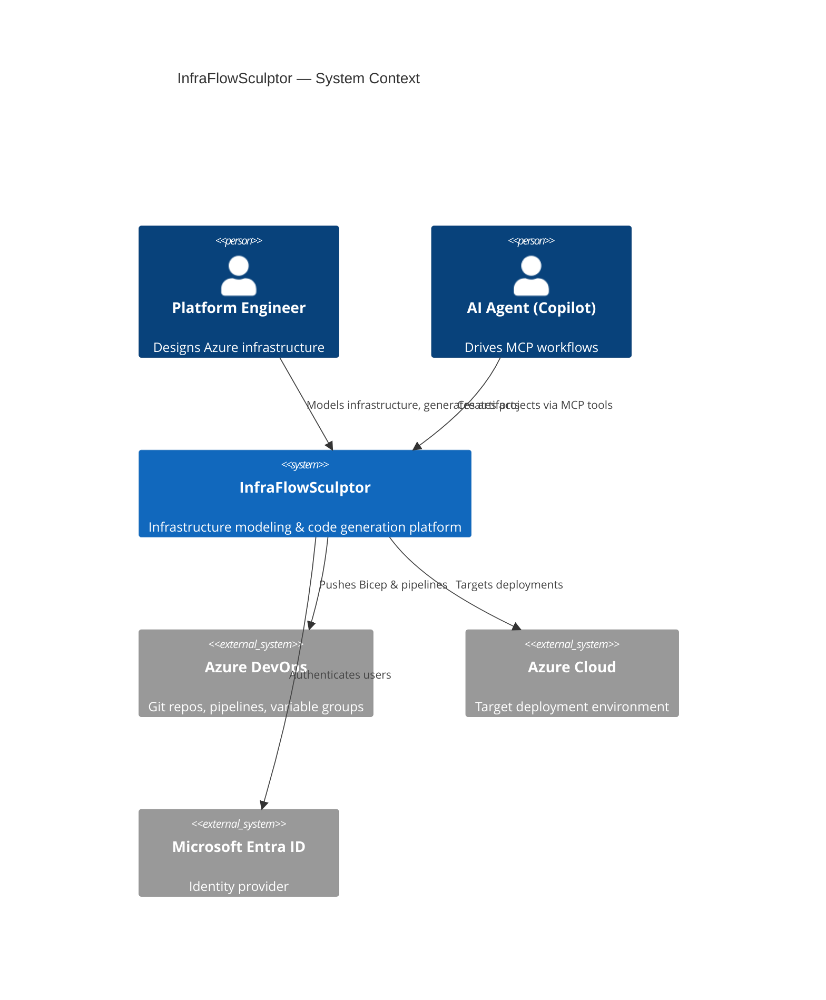

# InfraFlowSculptor — Documentation Portal

> **Azure Infrastructure Modeling & Generation Platform**
> One source of truth for Bicep, Azure DevOps pipelines, and MCP-driven project workflows.

---

## Table of Contents

| Section | Description | Audience |
|---------|-------------|----------|
| [Onboarding](onboarding/README.md) | Getting started, setup, first steps | New developers |
| [Architecture](architecture/README.md) | System design, patterns, decisions | All engineers |
| [Backend](backend/README.md) | .NET API, CQRS, Domain, Infrastructure | Backend devs |
| [Frontend](frontend/README.md) | Angular app, Design System, services | Frontend devs |
| [API Reference](api/README.md) | Endpoints, contracts, authentication | All devs |
| [Infrastructure](infrastructure/README.md) | Cloud architecture, Aspire, deployment | DevOps/SRE |
| [DevOps](devops/README.md) | CI/CD, pipelines, monitoring | DevOps/SRE |
| [Security](security/README.md) | Auth, secrets, OWASP, hardening | Security team |
| [ADR](adr/README.md) | Architecture Decision Records | Architects |
| [Runbooks](runbooks/README.md) | Operational procedures | SRE/On-call |
| [Troubleshooting](troubleshooting/README.md) | Common issues & solutions | All devs |
| [Glossary](glossary/README.md) | Terms and acronyms | Everyone |

---

## Platform Overview



## Quick Links

- **Run locally:** See [Onboarding > Local Setup](onboarding/local-setup.md)
- **Understand the architecture:** See [Architecture > Overview](architecture/overview.md)
- **API contracts:** See [API Reference](api/README.md)
- **Troubleshooting:** See [Troubleshooting](troubleshooting/README.md)

---

## Repository Structure

```
src/
├── Api/              → Main backend (Domain, Application, Infrastructure, Contracts, API)
├── Front/            → Angular frontend
├── Mcp/              → MCP server (Model Context Protocol)
├── Aspire/           → .NET Aspire orchestration
└── Shared/           → Cross-cutting shared libraries

tests/                → Unit & integration tests
scripts/              → Automation scripts
docs/                 → Architecture documentation
wiki/                 → This documentation (Azure DevOps Wiki)
```

---

## Technology Stack

| Layer | Technology | Version |
|-------|-----------|---------|
| Runtime | .NET | 10.0 |
| API Framework | ASP.NET Core Minimal APIs | 10.0 |
| Frontend | Angular | 21 |
| Database | PostgreSQL | 17.6 |
| ORM | Entity Framework Core | 10.0 |
| CQRS | MediatR | Latest |
| Validation | FluentValidation | Latest |
| Mapping | Mapster | Latest |
| Auth | Microsoft Entra ID (Azure AD) | — |
| Orchestration | .NET Aspire | 13.3 |
| AI Integration | Model Context Protocol (MCP) | 1.2.0 |
| Package Management | Central Package Management | — |
| Container Runtime | Docker | — |

---

*Last updated: 2026-05-27*
