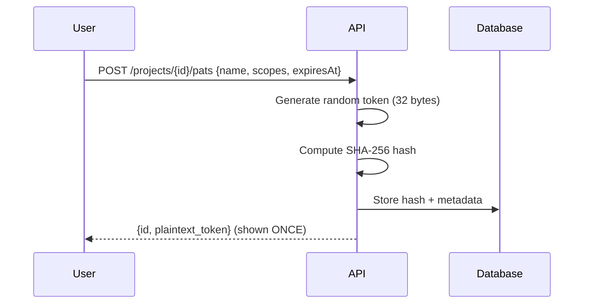

# API Authentication

## Supported Methods

| Method | Header | Format | Use Case |
|--------|--------|--------|----------|
| Entra ID JWT | `Authorization: Bearer <jwt>` | Standard JWT | Human users (frontend) |
| Personal Access Token | `Authorization: Bearer ifs_<token>` | Custom prefix | MCP, automation, CI/CD |

---

## JWT Bearer (Entra ID)

### Configuration

```json
{
  "AzureAd": {
    "Instance": "https://login.microsoftonline.com/",
    "TenantId": "<tenant-id>",
    "ClientId": "<api-client-id>",
    "Audience": "api://<api-client-id>"
  }
}
```

### Token Validation

The API validates:
1. Signature (against Entra ID JWKS)
2. Issuer (`iss` claim)
3. Audience (`aud` claim)
4. Expiration (`exp` claim)
5. Not Before (`nbf` claim)

### User Provisioning

On first authenticated request, the API auto-provisions the user via UPSERT:
- Extracts `oid` (Object ID) and `preferred_username` from claims
- Creates user record if not exists
- Returns existing user if already provisioned
- Race-safe via PostgreSQL UPSERT

---

## Personal Access Tokens (PAT)

### Creation Flow



### Token Format

```
ifs_<base64url-encoded-32-random-bytes>
```

- Prefix `ifs_` identifies it as an InfraFlowSculptor token
- 32 bytes of cryptographic randomness
- Base64url encoding (URL-safe, no padding)
- Total length: ~47 characters

### Scopes

| Scope | Allows |
|-------|--------|
| `Read` | All GET operations |
| `Write` | All POST/PUT/DELETE operations (includes Read) |
| `Generate` | Bicep/Pipeline generation endpoints |

### Validation Flow

1. Detect `ifs_` prefix in Bearer token
2. Compute SHA-256 of presented token
3. Look up hash in database
4. Verify not revoked
5. Verify not expired
6. Extract scopes → enforce via `PATScopeBehavior`

---

## 401 vs 403

| Code | Meaning | When |
|------|---------|------|
| 401 | Not authenticated | Missing/invalid/expired token |
| 403 | Insufficient permissions | Valid token, but wrong scope or no project access |

All protected endpoints declare `.ProducesProblem(401)` in their OpenAPI spec.
