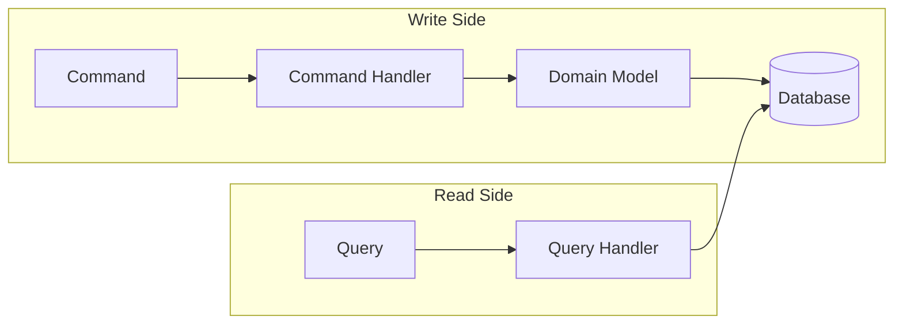
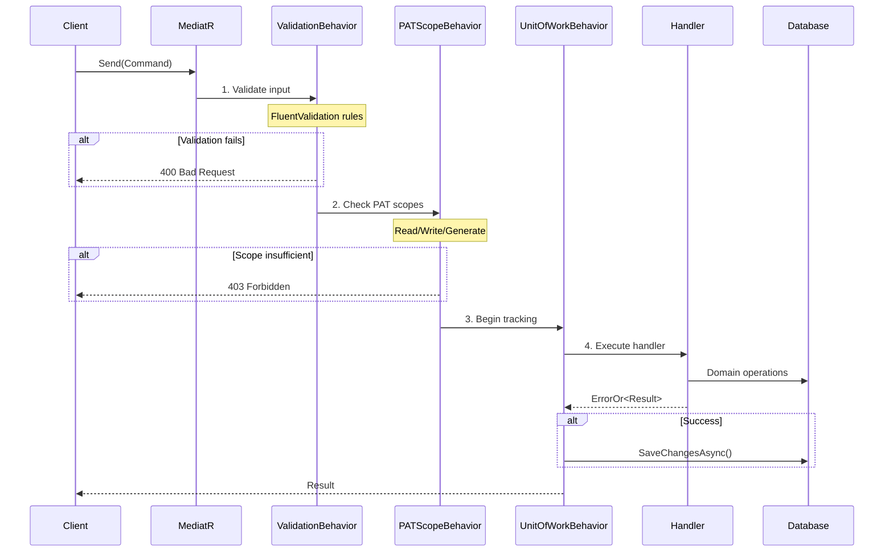

# CQRS Pattern

## What is CQRS?

**CQRS** (Command Query Responsibility Segregation) separates read operations (queries) from write operations (commands). Each has its own model, handler, and optimization path.

**Simple analogy:** Think of a restaurant. The waiter takes orders (commands) and delivers food (queries). The kitchen (handler) processes orders differently than the display case (read model) shows available dishes.



---

## Implementation in InfraFlowSculptor

### Marker Interfaces

```csharp
// Commands (write operations)
public interface ICommand<TResult> : IRequest<ErrorOr<TResult>>, ICommandBase;

// Queries (read operations)  
public interface IQuery<TResult> : IRequest<ErrorOr<TResult>>;

// Generation commands (requires 'Generate' PAT scope)
public interface IGenerateCommand<TResult> : ICommand<TResult>;

// Handlers
public interface ICommandHandler<in TCommand, TResult> 
    : IRequestHandler<TCommand, ErrorOr<TResult>>
    where TCommand : ICommand<TResult>;

public interface IQueryHandler<in TQuery, TResult> 
    : IRequestHandler<TQuery, ErrorOr<TResult>>
    where TQuery : IQuery<TResult>;
```

**Rule:** Never use `IRequest<ErrorOr<T>>` directly. Always use the project marker interfaces.

### Folder Structure

```
Application/
└── Projects/
    ├── Commands/
    │   ├── CreateProjectCommand/
    │   │   ├── CreateProjectCommand.cs
    │   │   ├── CreateProjectCommandHandler.cs
    │   │   └── CreateProjectCommandValidator.cs
    │   └── DeleteProjectCommand/
    │       ├── DeleteProjectCommand.cs
    │       ├── DeleteProjectCommandHandler.cs
    │       └── DeleteProjectCommandValidator.cs
    ├── Queries/
    │   ├── GetProjectQuery/
    │   │   ├── GetProjectQuery.cs
    │   │   └── GetProjectQueryHandler.cs
    │   └── ListMyProjectsQuery/
    │       ├── ListMyProjectsQuery.cs
    │       └── ListMyProjectsQueryHandler.cs
    └── Common/
        ├── ProjectResult.cs
        └── ProjectResultMapper.cs
```

---

## MediatR Pipeline

Every request flows through ordered **pipeline behaviors** before reaching the handler:



### Pipeline Order

| Order | Behavior | Applies To | Purpose |
|-------|----------|-----------|---------|
| 1 | `ValidationBehavior` | Commands only (`ICommandBase`) | FluentValidation rules |
| 2 | `PersonalAccessTokenScopeBehavior` | All | PAT scope enforcement |
| 3 | `UnitOfWorkBehavior` | Commands only (`ICommandBase`) | SaveChanges after success |

**Critical:** Queries bypass `ValidationBehavior` and `UnitOfWorkBehavior`.

---

## Command Example

```csharp
// 1. Command (the "what")
public sealed record CreateProjectCommand(
    string Name,
    string? LayoutPreset,
    IReadOnlyList<EnvironmentInput>? Environments
) : ICommand<ProjectResult>;

// 2. Validator (the "guard")
public sealed class CreateProjectCommandValidator 
    : AbstractValidator<CreateProjectCommand>
{
    public CreateProjectCommandValidator()
    {
        RuleFor(x => x.Name)
            .NotEmpty()
            .MaximumLength(80);
    }
}

// 3. Handler (the "how")
public sealed class CreateProjectCommandHandler 
    : ICommandHandler<CreateProjectCommand, ProjectResult>
{
    private readonly IProjectRepository _repository;
    private readonly ICurrentUser _currentUser;

    public CreateProjectCommandHandler(
        IProjectRepository repository, 
        ICurrentUser currentUser)
    {
        _repository = repository;
        _currentUser = currentUser;
    }

    public async Task<ErrorOr<ProjectResult>> Handle(
        CreateProjectCommand command, 
        CancellationToken cancellationToken)
    {
        var userId = await _currentUser.GetUserIdAsync();
        if (userId is null)
            return Error.Unauthorized();

        var project = Project.Create(command.Name, userId.Value);
        
        await _repository.AddAsync(project);
        
        return ProjectResultMapper.Map(project);
    }
}
```

---

## Query Example

```csharp
// 1. Query (the "what")
public sealed record GetProjectQuery(Guid Id) : IQuery<ProjectResult>;

// 2. Handler (the "how")
public sealed class GetProjectQueryHandler 
    : IQueryHandler<GetProjectQuery, ProjectResult>
{
    private readonly IProjectRepository _repository;
    private readonly IProjectAccessService _accessService;

    public async Task<ErrorOr<ProjectResult>> Handle(
        GetProjectQuery query, 
        CancellationToken cancellationToken)
    {
        await _accessService.VerifyReadAccessAsync(new ProjectId(query.Id));
        
        var project = await _repository.GetByIdReadOnlyAsync(
            new ProjectId(query.Id));
        
        if (project is null)
            return Errors.Project.NotFound(new ProjectId(query.Id));
        
        return ProjectResultMapper.Map(project);
    }
}
```

---

## Unit of Work

The Unit of Work ensures **exactly one `SaveChangesAsync()`** per command:

```csharp
public sealed class UnitOfWorkBehavior<TRequest, TResponse> 
    : IPipelineBehavior<TRequest, TResponse>
    where TRequest : ICommandBase
{
    private readonly IUnitOfWork _unitOfWork;

    public async Task<TResponse> Handle(
        TRequest request,
        RequestHandlerDelegate<TResponse> next,
        CancellationToken cancellationToken)
    {
        var result = await next();
        
        // Only save if the handler succeeded
        if (result is ErrorOr<object> errorOr && !errorOr.IsError)
        {
            await _unitOfWork.SaveChangesAsync(cancellationToken);
        }
        
        return result;
    }
}
```

**Critical rule:** Repositories must NEVER call `SaveChangesAsync()`. Only the Unit of Work behavior does.

---

## Validation Strategy

### Where validation lives

| Layer | What it validates | Example |
|-------|------------------|---------|
| **FluentValidation** | Input shape, required fields, max lengths | "Name must not be empty" |
| **Handler** | Authorization, existence checks | "Project not found" |
| **Domain** | Business invariants | "No cyclic dependencies" |

### Validator convention

```csharp
// Narrow scope: validate input contract only
public sealed class CreateProjectCommandValidator 
    : AbstractValidator<CreateProjectCommand>
{
    public CreateProjectCommandValidator()
    {
        // Required IDs
        RuleFor(x => x.Name).NotEmpty().MaximumLength(80);
        
        // Catalog-backed inputs (validate value exists)
        RuleFor(x => x.ResourceType)
            .Must(t => AzureResourceTypes.All.Contains(t))
            .When(x => x.ResourceType is not null);
    }
}
```

**Closure rule:** Validators handle input shape only. Existence checks, authorization, and business state semantics stay in handlers/domain.

---

## Key Design Decisions

### Why CQRS over simple CRUD?

| Concern | CRUD | CQRS |
|---------|------|------|
| Intent clarity | Generic "Update" | Specific "SetEnvironmentSettings" |
| Validation | One validator per entity | One validator per operation |
| Optimization | Same model for read/write | Read can be optimized separately |
| Security | Blanket permissions | Per-operation authorization |
| Scalability | Coupled | Independent scaling of reads/writes |

### Why ErrorOr over exceptions?

| Concern | Exceptions | ErrorOr |
|---------|-----------|---------|
| Performance | Stack unwinding is expensive | Zero-cost return |
| Composability | Try/catch nesting | Simple `if (result.IsError)` |
| Explicitness | Hidden control flow | Visible in return type |
| Documentation | Must read implementation | Error cases in type signature |
