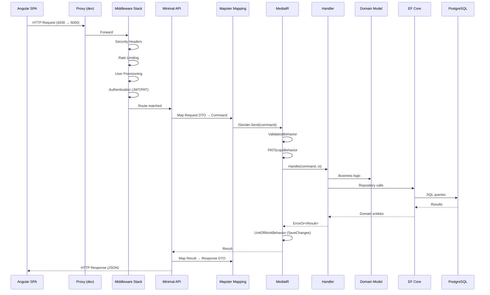
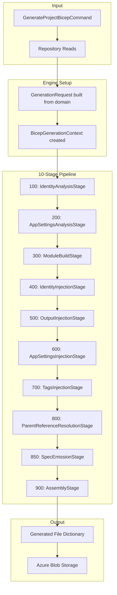
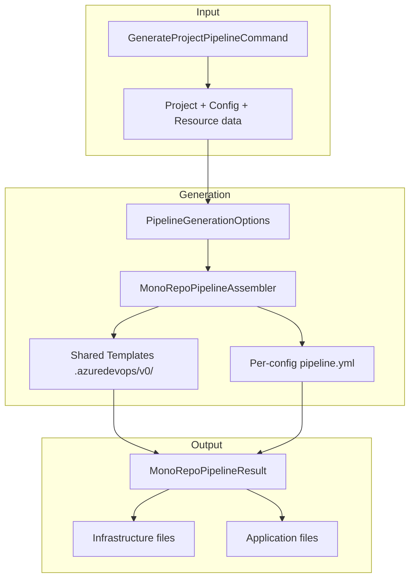
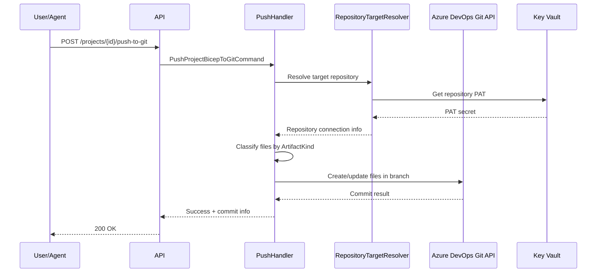
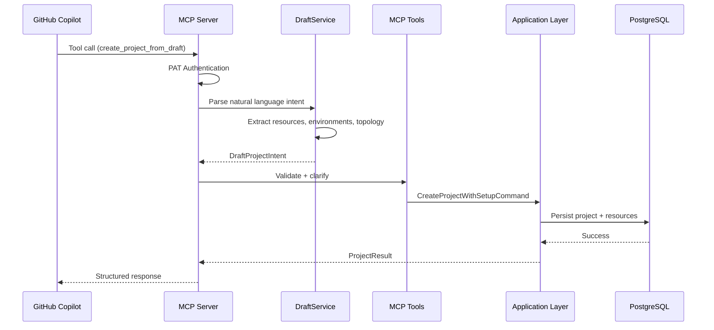
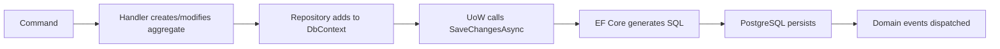
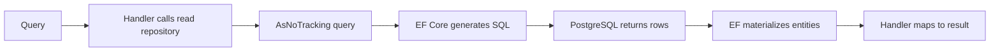

# Data Flow

## Request Lifecycle

### HTTP Request → Response

---

## Bicep Generation Flow

The generation process transforms the domain model into deployable Bicep files:

### Stage Details

| Stage | Order | Purpose | Input | Output |
|-------|-------|---------|-------|--------|
| IdentityAnalysis | 100 | Determines which resources need system/user-assigned identities | Resource definitions | Identity sets on context |
| AppSettingsAnalysis | 200 | Identifies which outputs feed into app settings | Resource connections | Output injection list |
| ModuleBuild | 300 | Calls per-type generators to produce IR specs | Resource definitions | `ModuleWorkItem` with `BicepModuleSpec` |
| IdentityInjection | 400 | Adds identity blocks to modules | Identity analysis | Modified specs |
| OutputInjection | 500 | Adds output declarations | AppSettings analysis | Modified specs |
| AppSettingsInjection | 600 | Injects app setting parameter references | Output analysis | Modified specs |
| TagsInjection | 700 | Adds `tags` parameter to all modules | — | Modified specs |
| ParentReferenceResolution | 800 | Resolves parent resource references (ASP→WebApp, etc.) | FK relationships | Modified specs |
| SpecEmission | 850 | Converts IR (`BicepModuleSpec`) to Bicep text | IR specs | Text modules |
| Assembly | 900 | Assembles `main.bicep`, parameter files, types | Text modules | Final file dictionary |

---

## Pipeline Generation Flow

---

## Push-to-Git Flow

### Repository Routing (Layout-Driven)

| Layout Preset | Infra Files | App Files |
|--------------|-------------|-----------|
| `AllInOne` | Same repo | Same repo |
| `SplitInfraCode` | Infra repo | Code repo |
| `MultiRepo` | Per-config repos | Per-config repos |

---

## MCP Tool Flow

---

## Data Persistence Flow

### Write Path (Command)

### Read Path (Query)

**Key difference:** Write path uses tracked entities + Unit of Work. Read path uses `AsNoTracking()` for performance.
