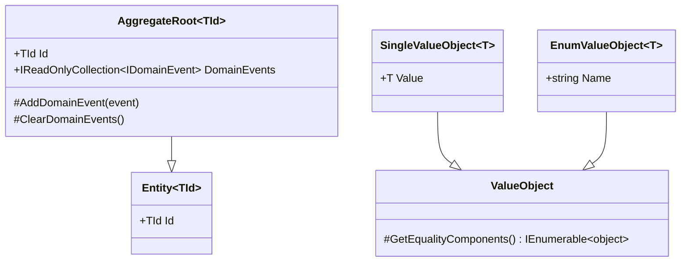
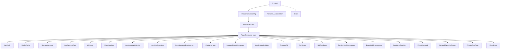

# Domain-Driven Design (DDD)

## What is DDD?

**Domain-Driven Design** is a software design approach that focuses on modeling the business domain. Instead of building code around technical concerns (database tables, API endpoints), DDD builds code around business concepts.

**Simple analogy:** If you're building a library management system, your code talks about "Books", "Members", and "Loans" — not "Table1", "Row", and "ForeignKey".

---

## DDD Building Blocks in InfraFlowSculptor



### Aggregate Root

The **Aggregate Root** is the entry point to a cluster of related objects. All external access goes through the root.

**In InfraFlowSculptor:** Each Azure resource type is an aggregate root. `Project` and `InfrastructureConfig` are also aggregate roots.

```csharp
// Example: ContainerApp is an aggregate root
public sealed class ContainerApp : AzureResource
{
    // Private constructor for EF Core
    private ContainerApp() { }
    
    // Public factory method (DOM-006 convention)
    public static ContainerApp Create(
        ResourceGroupId resourceGroupId,
        string name,
        Location location,
        ContainerAppEnvironmentId containerAppEnvironmentId,
        bool isExisting = false)
    {
        // Business validation here
        return new ContainerApp { /* ... */ };
    }
    
    // Domain behavior methods
    public void Update(string name, Location location, /* ... */) { }
    public void SetEnvironmentSettings(/* ... */) { }
}
```

### Entity

An **Entity** has identity (an ID) and lifecycle. It belongs to an aggregate.

**In InfraFlowSculptor:** `ProjectMember`, `AppSetting`, `RoleAssignment`, `CustomDomain`.

### Value Object

A **Value Object** has no identity. It's defined by its properties. Two value objects with the same properties are equal.

**In InfraFlowSculptor:** `Location`, `ProjectId`, `ResourceGroupId`, `AcrAuthMode`.

```csharp
// Strongly-typed ID (Value Object)
public sealed class ProjectId : SingleValueObject<Guid>
{
    public ProjectId(Guid value) : base(value) { }
}

// Enum-backed Value Object
public sealed class AcrAuthMode : EnumValueObject<AcrAuthMode>
{
    public static readonly AcrAuthMode ManagedIdentity = new("ManagedIdentity");
    public static readonly AcrAuthMode AdminCredentials = new("AdminCredentials");
}
```

---

## Aggregate Map

InfraFlowSculptor has **24 aggregates**, organized in a hierarchy:



### Inheritance Strategy: Table-Per-Type (TPT)

All 22 Azure resource types inherit from `AzureResource` using EF Core's **TPT** (Table-Per-Type) mapping:

```csharp
// Base class (shared properties)
public abstract class AzureResource : AggregateRoot<AzureResourceId>
{
    public string Name { get; private set; }
    public Location Location { get; private set; }
    public ResourceGroupId ResourceGroupId { get; private set; }
    public bool IsExisting { get; protected set; }
    // ...shared behavior...
}

// Concrete type (specific properties)
public sealed class ContainerApp : AzureResource
{
    public ContainerAppEnvironmentId ContainerAppEnvironmentId { get; private set; }
    public string? DockerImageName { get; private set; }
    // ...ContainerApp-specific behavior...
}
```

**Why TPT?** Each resource type has different properties but shares common behavior (naming, role assignments, dependencies). TPT gives each type its own table while sharing the base `AzureResources` table.

---

## Domain Invariants

Invariants are **business rules that must always be true**. The domain model enforces them:

| Invariant | Enforcement |
|-----------|-------------|
| Resource names are non-empty | `Create()` factory validates |
| No self-dependencies | `AddDependency()` checks |
| No cyclic dependencies | `AddDependency()` checks graph |
| Dependencies within same resource group | `AddDependency()` validates |
| Duplicate custom domains rejected | `AddCustomDomain()` checks uniqueness |
| IsExisting resources can't be updated | `Update()` guards with early return |
| Project members have valid roles | `AddMember()` validates |

### Encapsulation Pattern

```csharp
// Properties use private setters
public string Name { get; private set; }

// Collections are read-only externally
private readonly List<ProjectMember> _members = [];
public IReadOnlyCollection<ProjectMember> Members => _members;

// Behavior methods enforce invariants
public void AddMember(UserId userId, ProjectRole role)
{
    if (_members.Any(m => m.UserId == userId))
        throw new DomainException("Member already exists");
    
    _members.Add(new ProjectMember(userId, role));
}
```

---

## Domain Events

Domain events signal that something meaningful happened in the domain:

```csharp
public sealed record ProjectCreatedDomainEvent(ProjectId ProjectId) : IDomainEvent;

// Raised in the Create factory
public static Project Create(string name, /* ... */)
{
    var project = new Project { /* ... */ };
    project.AddDomainEvent(new ProjectCreatedDomainEvent(project.Id));
    return project;
}
```

**Current scope:** Domain events are in-process only. No outbox pattern or integration events yet (intentionally narrow seam).

---

## Error Definitions

Domain errors are defined as static partial classes:

```csharp
// src/Api/InfraFlowSculptor.Domain/Common/Errors/Errors.Project.cs
public static partial class Errors
{
    public static class Project
    {
        public static Error NotFound(ProjectId id) =>
            Error.NotFound("Project.NotFound", $"Project with id '{id.Value}' was not found.");
        
        public static Error AlreadyMember(UserId userId) =>
            Error.Conflict("Project.AlreadyMember", $"User '{userId.Value}' is already a member.");
    }
}
```

**Convention:** Never use inline `Error.*()` in handlers — always define in `Errors.AggregateName.*`.

---

## Key Design Decisions

### Why sealed aggregates?

All concrete `AzureResource` subtypes are `sealed`:
- Prevents accidental inheritance chains
- Enables compiler optimizations
- Makes the type hierarchy explicit and finite

### Why Value Objects for IDs?

```csharp
// Instead of: Guid projectId
// We use:    ProjectId projectId

public sealed class ProjectId : SingleValueObject<Guid> { }
```

Benefits:
- **Type safety** — Can't accidentally pass a `ResourceGroupId` where a `ProjectId` is expected
- **Self-documenting** — The type name explains what the value represents
- **Encapsulation** — Future format changes don't leak

### Why static Create() factories?

```csharp
// Instead of: new Project(name, ...)
// We use:     Project.Create(name, ...)
```

Benefits:
- **Validation** — Factory can validate before creating
- **Events** — Factory raises creation events
- **Testing** — Clear contract for what's needed to create
- **EF Core** — Parameterless constructor stays private
