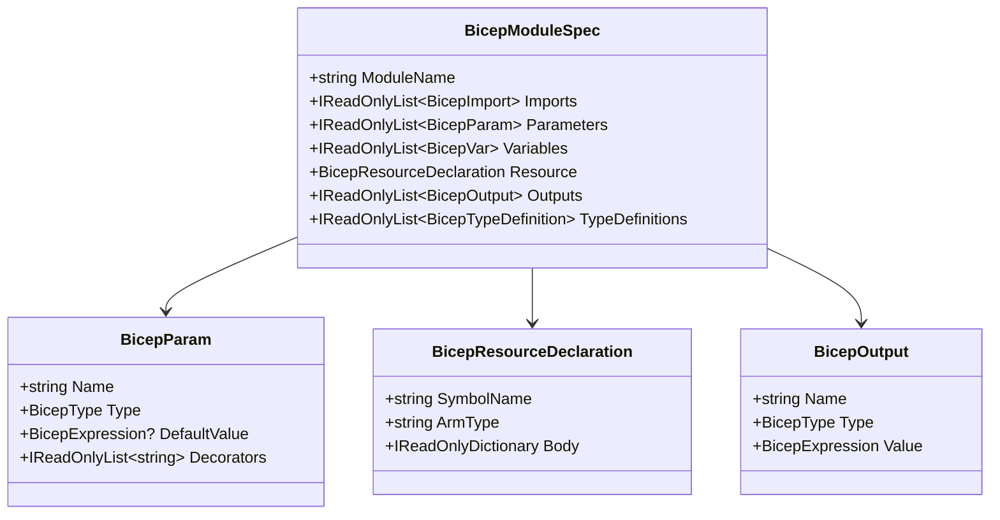
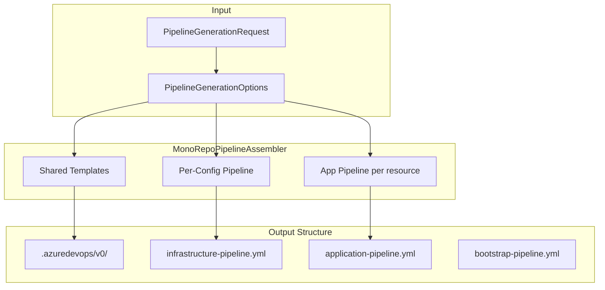

# Generation Engines

## Overview

InfraFlowSculptor has two generation engines that transform the domain model into deployable artifacts:

| Engine | Output | Purpose |
|--------|--------|---------|
| **Bicep Generation** | `.bicep` files, parameter files, type definitions | Azure resource deployment |
| **Pipeline Generation** | YAML pipeline files | Azure DevOps CI/CD |

Both engines are **pure** — they have no domain dependency and operate on DTOs (`GenerationRequest`).

---

## Bicep Generation Engine

### Architecture

```mermaid
flowchart TB
    subgraph "Input (from Application)"
        GR[GenerationRequest]
        ENV[EnvironmentDefinition[]]
        RES[ResourceDefinition[]]
    end
    
    subgraph "BicepGenerationEngine"
        PIPE[BicepGenerationPipeline]
        CTX[BicepGenerationContext]
        
        subgraph "Stages (ordered)"
            S1[100: IdentityAnalysis]
            S2[200: AppSettingsAnalysis]
            S3[300: ModuleBuild]
            S4[400: IdentityInjection]
            S5[500: OutputInjection]
            S6[600: AppSettingsInjection]
            S7[700: TagsInjection]
            S8[800: ParentReferenceResolution]
            S9[850: SpecEmission]
            S10[900: Assembly]
        end
    end
    
    subgraph "Per-Type Generators"
        GEN[IResourceTypeBicepGenerator]
        SPEC[IResourceTypeBicepSpecGenerator]
    end
    
    subgraph "IR Layer"
        BUILDER[BicepModuleBuilder]
        IR[BicepModuleSpec]
        EMIT[BicepEmitter]
    end
    
    subgraph "Output"
        FILES[IReadOnlyDictionary string string]
    end
    
    GR --> PIPE
    PIPE --> CTX
    CTX --> S1 --> S2 --> S3 --> S4 --> S5 --> S6 --> S7 --> S8 --> S9 --> S10
    S3 --> GEN
    GEN --> SPEC
    SPEC --> BUILDER
    BUILDER --> IR
    S9 --> EMIT
    EMIT --> S10
    S10 --> FILES
```

### Intermediate Representation (IR)

The IR is a typed model representing a Bicep module before text emission:



### Builder Pattern

Generators use the fluent `BicepModuleBuilder`:

```csharp
var spec = BicepModuleBuilder.Create("containerapp")
    .WithImport("az", "az@1.0.0")
    .WithParam("name", BicepType.String)
    .WithParam("location", BicepType.String)
    .WithResource("containerApp", armType)
        .WithProperty("name", Expr.Param("name"))
        .WithProperty("location", Expr.Param("location"))
    .WithOutput("id", BicepType.String, Expr.Ref("containerApp.id"))
    .Build();
```

### Per-Type Generators

Each Azure resource type has a dedicated generator:

```csharp
public interface IResourceTypeBicepSpecGenerator : IResourceTypeBicepGenerator
{
    BicepModuleSpec GenerateSpec(ResourceDefinition resource, GenerationContext context);
}
```

**22 generators registered as singletons** — one per Azure resource type.

### Assembly

The `AssemblyStage` produces the final file structure:

```
modules/
├── ContainerApp/
│   └── containerapp.module.bicep
├── KeyVault/
│   └── keyvault.module.bicep
├── Common/
│   └── types.bicep
main.bicep
parameters/
├── dev.bicepparam
├── staging.bicepparam
└── prod.bicepparam
```

---

## Pipeline Generation Engine

### Architecture



### Pipeline Types Generated

| Type | Purpose | Stages |
|------|---------|--------|
| **Infrastructure** | Deploy Bicep modules | Validate → What-If → Deploy (per env) |
| **Application** | Build & deploy apps | Build → Test → Deploy (per env) |
| **Bootstrap** | First-time infra setup | Create RGs → Deploy shared → Deploy config |

### Shared Templates (`.azuredevops/v0/`)

```yaml
# Template structure
.azuredevops/
└── v0/
    ├── deploy-bicep.yml        # Reusable Bicep deployment step
    ├── validate-bicep.yml      # Bicep validation step
    ├── what-if-bicep.yml       # What-If analysis step
    └── deploy-app.yml          # Application deployment step
```

---

## Cross-Config References

When a resource in one config references a resource in another config, the Bicep engine emits `existing` declarations:

```bicep
// Cross-config reference in main.bicep
resource existingSharedRg 'Microsoft.Resources/resourceGroups@2023-07-01' existing = {
  name: sharedResourceGroupName
}

resource existingKeyVault 'Microsoft.KeyVault/vaults@2023-07-01' existing = {
  name: sharedKeyVaultName
  scope: existingSharedRg
}
```

---

## Mono-Repo vs Multi-Repo

| Layout | Structure | Common folder |
|--------|-----------|---------------|
| `AllInOne` | All configs in one repo | `Common/` at root |
| `SplitInfraCode` | Infra + Code repos | `Common/` in infra repo |
| `MultiRepo` | Per-config repos | No `Common/` (flat) |

---

## Key Design Decisions

### Why a staged pipeline?

**Alternative considered:** Single monolithic generation function.

**Decision:** 10 ordered stages because:
- Each stage has a single responsibility
- Stages can be tested independently
- New transformations (tags, identity) are additive
- Order is explicit and documented
- Cancellation can check between stages

### Why IR over direct text generation?

**Alternative considered:** String templates with interpolation.

**Decision:** Typed IR (`BicepModuleSpec`) because:
- Type safety catches structural errors at build time
- Transformers can modify the model without regex
- Testing is assertion-based, not string comparison
- Text emission is separated from logic
- Supports future output formats (ARM JSON, Terraform)

### Why pure engines (no domain dependency)?

**Alternative considered:** Engines directly access domain aggregates.

**Decision:** Engines receive DTOs because:
- Generation is a pure function (input → output)
- Testable without database or DI
- Can be extracted to a separate service later
- No accidental mutations during generation
