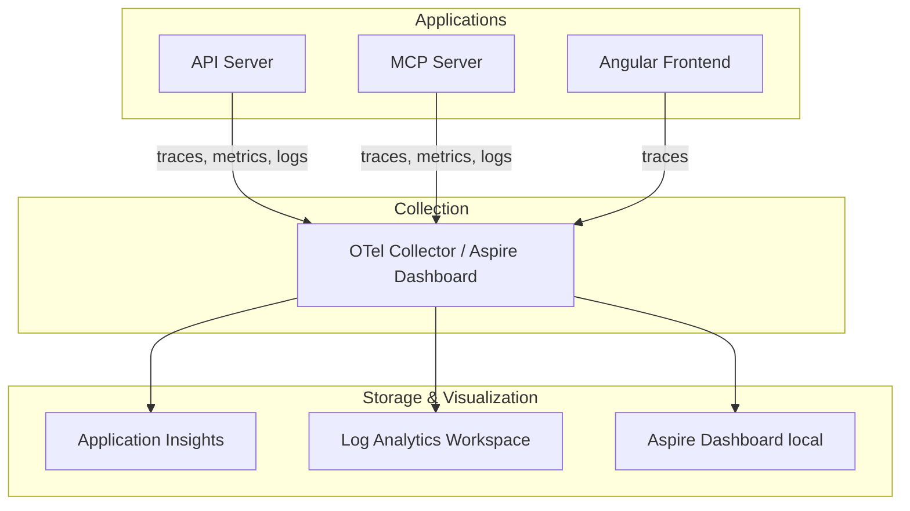

# Observability

## Strategy

InfraFlowSculptor uses the **three pillars of observability**: logs, traces, and metrics, all exported via OpenTelemetry (OTel).

---

## OpenTelemetry Configuration

### Backend (.NET)

OTel is configured in `Infrastructure.DependencyInjection.AddObservability()`:

- **Traces:** HTTP requests, EF Core queries, MediatR handlers, MCP tool calls
- **Metrics:** Request rates, response times, error rates
- **Logs:** Structured logging via `ILogger<T>`
- **Export:** Conditional OTLP export when `OTEL_EXPORTER_OTLP_ENDPOINT` is set

### MCP-Specific Sources

The MCP host registers additional OTel sources:
- `Experimental.ModelContextProtocol`
- `ModelContextProtocol`
- `ModelContextProtocol.Core`

This ensures MCP tool invocations appear as distinct traces in the dashboard.

### Frontend (Angular)

- `TelemetryService` initializes via `APP_INITIALIZER`
- Only active when `environment.otlpEnabled === true` (Aspire mode)
- Exports traces to the Aspire Dashboard OTLP endpoint

---

## Local Development (Aspire Dashboard)

When running with Aspire, the dashboard at `http://localhost:15888` provides:

| Feature | Usage |
|---------|-------|
| **Traces** | End-to-end request tracing across API + MCP + DB |
| **Structured Logs** | Searchable, structured log entries |
| **Console Logs** | Raw stdout/stderr from each resource |
| **Metrics** | Request rates, latencies, error counts |
| **Resource Health** | Status of all Aspire-managed resources |

### Debugging with Traces

1. Make an API request
2. Open the Aspire Dashboard → Traces
3. Find the trace by route or timestamp
4. See the full call chain: HTTP → MediatR → EF Core → PostgreSQL
5. Identify slow spans

---

## Production Monitoring

### Application Insights Integration

In production, OTel data flows to Azure Application Insights:

| Signal | Application Insights Feature |
|--------|------------------------------|
| Traces | Transaction Search, End-to-End view |
| Metrics | Metrics Explorer, Custom dashboards |
| Logs | Log Analytics queries (KQL) |
| Exceptions | Failures blade, Smart Detection |

### Health Checks

Both API and MCP expose health endpoints:

| Endpoint | Purpose | Rate Limited |
|----------|---------|-------------|
| `/health` | Full health check (DB connectivity) | Yes (`HealthChecks` policy) |
| `/alive` | Liveness probe (app is running) | Yes (`HealthChecks` policy) |

### Key Log Categories

| Category | Level | When |
|----------|-------|------|
| `InfraFlowSculptor.Api` | Information | Request handling |
| `InfraFlowSculptor.Application` | Information | Command/query execution |
| `InfraFlowSculptor.Infrastructure` | Warning | External service issues |
| `Microsoft.EntityFrameworkCore` | Warning | Slow queries, model warnings |
| `InfraFlowSculptor.Mcp` | Information | MCP tool invocations |

---

## Alerting Strategy

| Alert | Condition | Severity |
|-------|-----------|----------|
| High error rate | > 1% of requests return 5xx | Critical |
| Slow responses | p95 > 2000ms for 5 minutes | Warning |
| Database connectivity | Health check fails 3x | Critical |
| Rate limit exhaustion | > 50% of requests throttled | Warning |
| MCP auth failures | > 10 PAT auth failures/minute | Warning |
