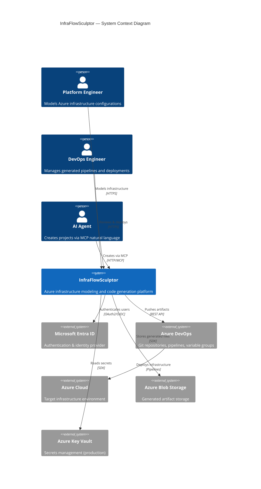
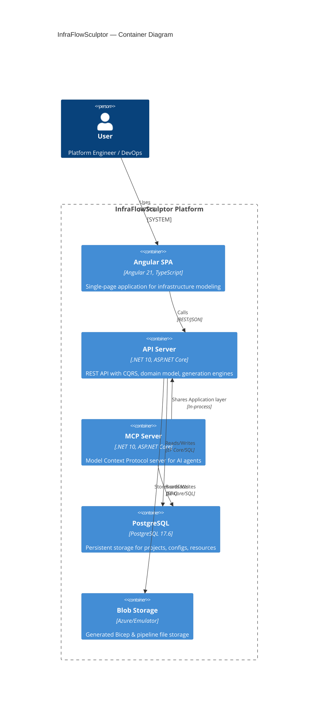
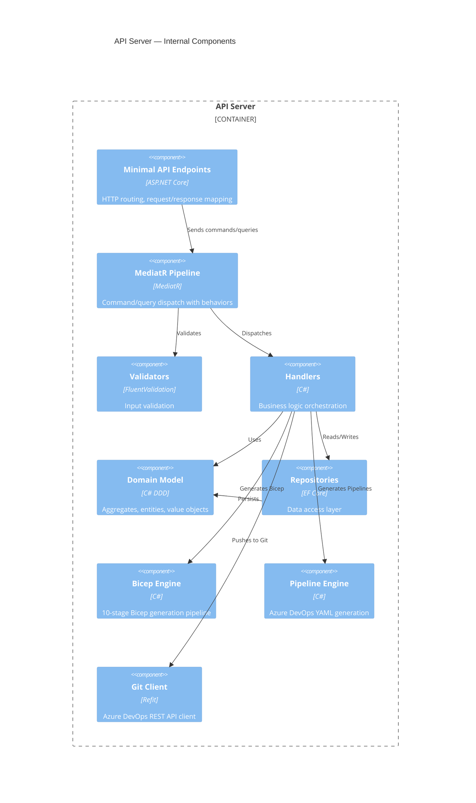
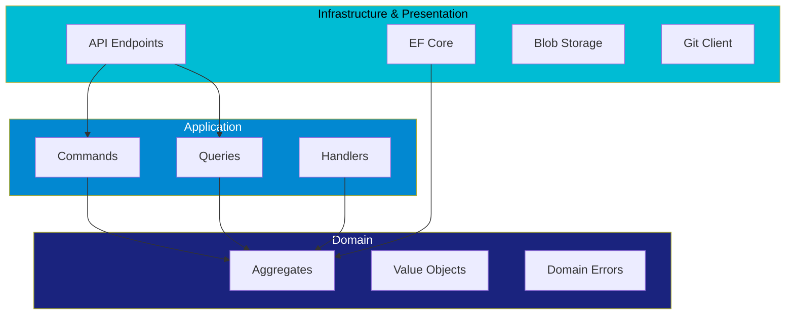
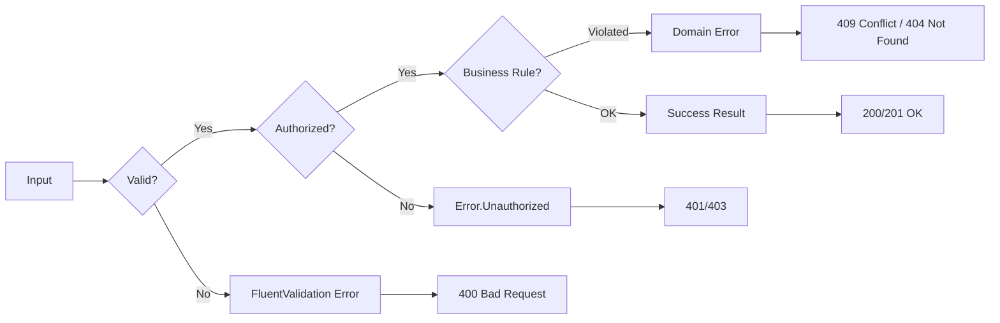
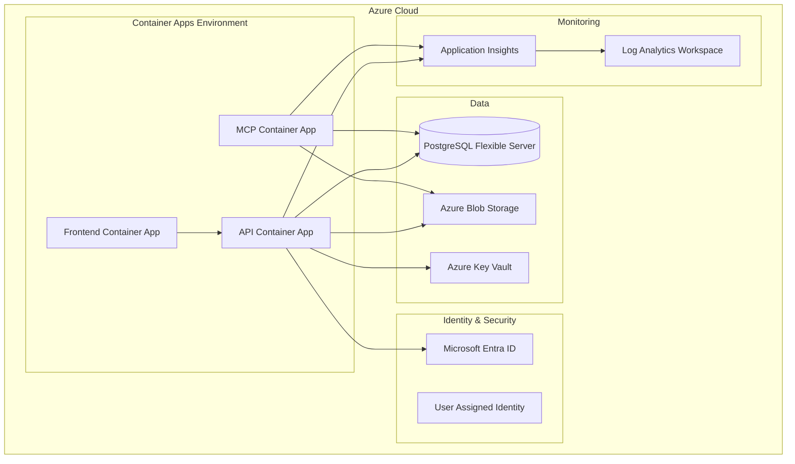
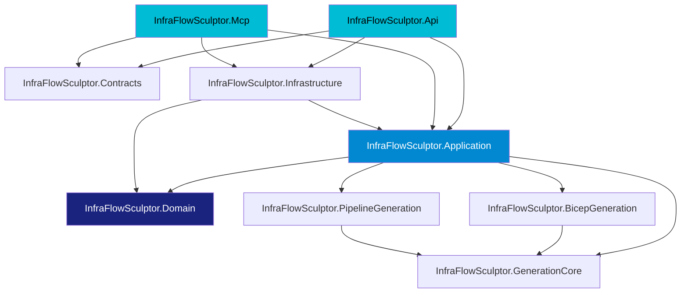

# Architecture Overview

## C4 Model — System Context

## C4 Model — Container Diagram

## C4 Model — Component Diagram (API Server)

---

## Design Principles

### Clean Architecture

The project strictly follows Clean Architecture with the **Dependency Rule**: source code dependencies must point only inward.

**Key rule:** The Domain layer has **zero** external dependencies. It doesn't know about EF Core, ASP.NET, or any infrastructure concern.

### SOLID Principles Applied

| Principle | Example in Codebase |
|-----------|-------------------|
| **S**ingle Responsibility | Each handler does one thing |
| **O**pen/Closed | New resource types via new classes, not modifying existing |
| **L**iskov Substitution | All `AzureResource` subtypes are interchangeable |
| **I**nterface Segregation | `IRepository<T>` vs `IReadOnlyRepository<T>` |
| **D**ependency Inversion | Handlers depend on `IRepository<T>`, not `DbContext` |

### Error Handling Philosophy

Exceptions are reserved for truly unexpected situations (infrastructure failures). All expected errors flow through `ErrorOr<T>`.

---

## Deployment Architecture

---

## Module Dependency Graph

**Important:** The MCP server does **not** reference the API project directly. It shares the Application and Infrastructure layers.
