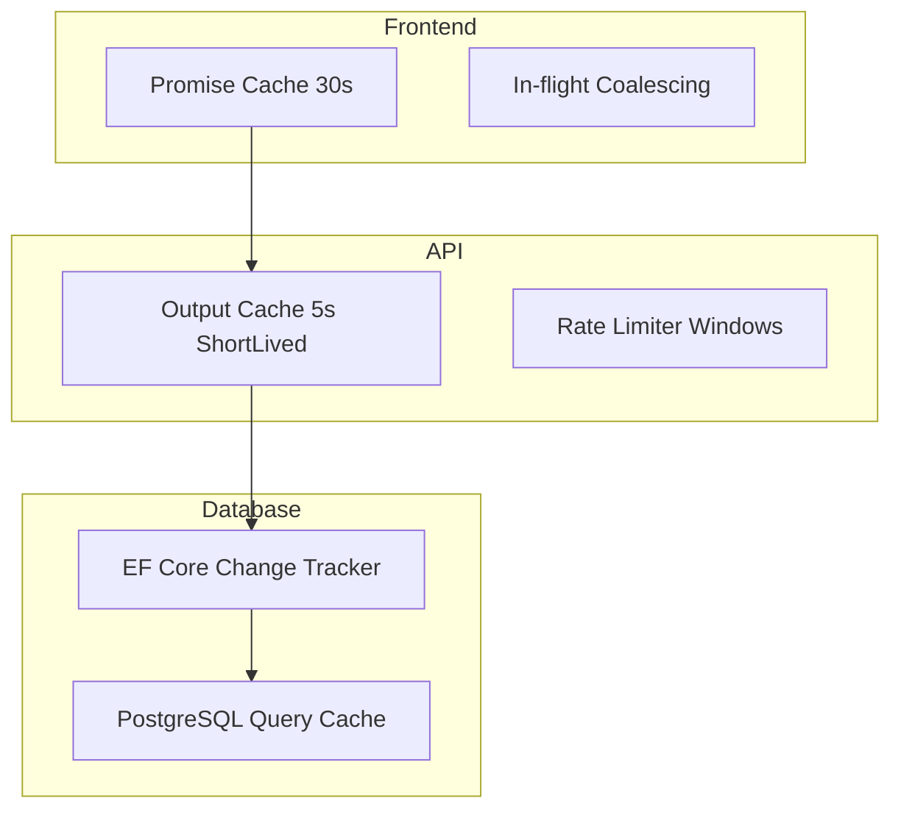
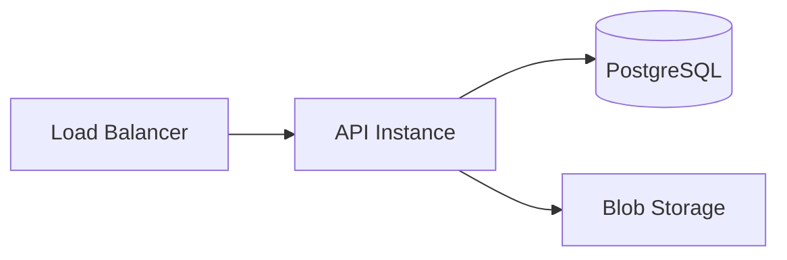
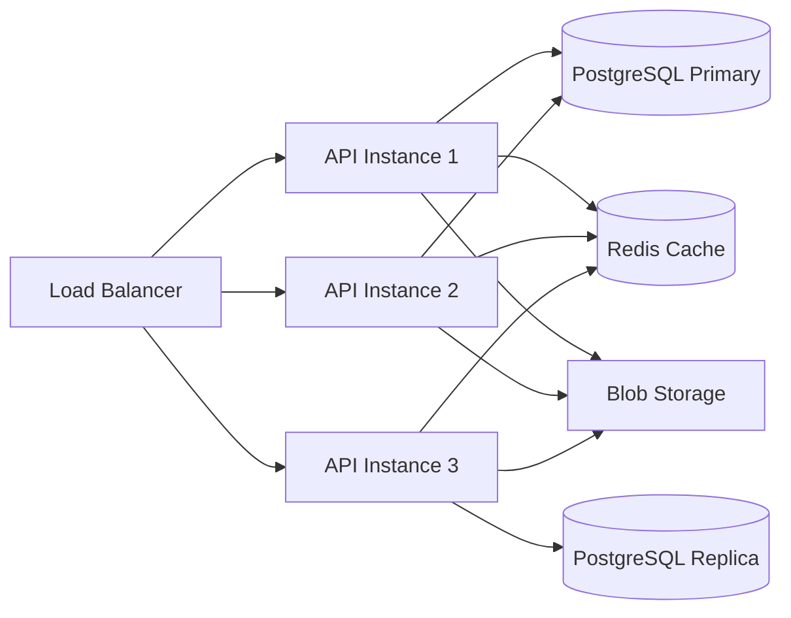

# Scalability & Performance

## Current Architecture Characteristics

| Dimension | Current State | Design Ceiling |
|-----------|--------------|----------------|
| Concurrent users | Designed for team-scale (5-50 users) | Horizontal API scaling possible |
| Database | Single PostgreSQL instance | Read replicas, connection pooling |
| Generation | Synchronous in-request | Async queue possible |
| File storage | Azure Blob Storage | Already cloud-scale |
| Caching | In-memory + output caching | Redis cache tier available |

---

## Performance Optimizations

### Database Layer

| Optimization | Where | Impact |
|-------------|-------|--------|
| **AsNoTracking** | All read queries | Eliminates change tracker overhead |
| **Dedicated read repositories** | Query handlers | Projection instead of full aggregate |
| **SQL views** | Resource/environment reads | Pre-joined data, no N+1 |
| **Targeted batch queries** | Storage Account sub-resources | 3 queries vs full graph load |
| **Include helpers** | Resource repositories | Shared eager-loading, no duplication |
| **PostgreSQL xmin** | Concurrency control | Native, no extra columns |
| **UPSERT** | User provisioning | Race-free, single statement |
| **Indexes** | FK columns, resource type | Query plan optimization |

### API Layer

| Optimization | Where | Impact |
|-------------|-------|--------|
| **Output caching** | Select GET endpoints | 5s short-lived cache |
| **Rate limiting** | Global + per-endpoint | Prevents abuse |
| **Request body limits** | All endpoints | 50 MB max |
| **Response compression** | Middleware | Smaller payloads |

### Frontend Layer

| Optimization | Where | Impact |
|-------------|-------|--------|
| **Promise cache + coalescing** | `ProjectService.getProjectResources()` | 30s cache, dedup in-flight |
| **Cache invalidation** | After mutations | Fresh data when needed |
| **Lazy-loaded routes** | Feature modules | Smaller initial bundle |
| **Immutable assets** | nginx 1-year cache | No re-downloads |
| **gzip** | nginx for JS/CSS/JSON | 60-80% size reduction |

---

## Caching Strategy

### Cache Invalidation Rules

- Frontend: Invalidated on write operations via service-level helpers
- API Output Cache: Varies by `Authorization` header, 5s TTL
- EF Core: Change tracker scoped to request (no cross-request caching)

---

## Scalability Path

### Current (Single Instance)

### Future (Horizontal Scaling)

### Scaling Considerations

| Concern | Current | Scalable Path |
|---------|---------|---------------|
| Session state | Stateless (JWT) | Already scale-ready |
| Database | Single writer | Read replicas for queries |
| Generation | In-process | Background jobs + queue |
| File storage | Blob Storage | Already distributed |
| Rate limiting | In-memory | Redis-backed distributed |
| MCP drafts | In-memory per instance | Distributed cache or DB |

---

## Performance Monitoring

### Key Metrics

| Metric | Target | Alert Threshold |
|--------|--------|-----------------|
| API response time (p95) | < 500ms | > 2000ms |
| Database query time (p95) | < 100ms | > 500ms |
| Generation time (full project) | < 10s | > 30s |
| Frontend LCP | < 2.5s | > 4s |
| Error rate | < 0.1% | > 1% |

### Known Hot Paths

| Path | Current Latency | Root Cause |
|------|----------------|------------|
| `GET /container-app/{id}` | ~2.2s | Full TPT graph materialization |
| Project-level Bicep generation | ~5-15s | 10 stages × N resources |
| Full test suite | ~45s | Comprehensive coverage |

### Mitigations Applied

- `ContainerAppReadRepository`: Targeted projection instead of aggregate materialization
- `ProjectResourceReadRepository`: Flat list from `AzureResources` joined via `ResourceGroup`
- Generation: Cancellation token propagation between stages
