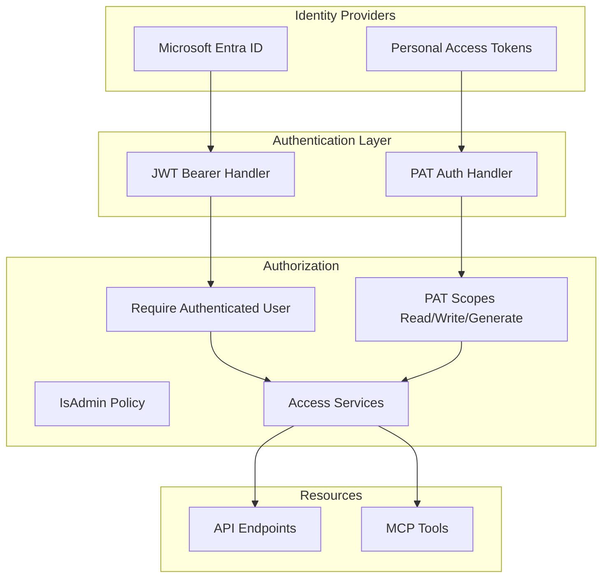
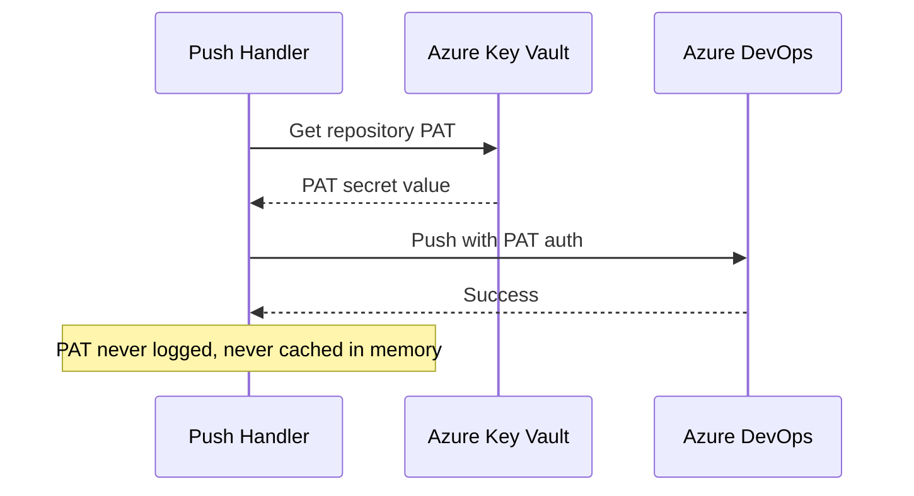

# Security Architecture

## Authentication & Authorization Overview



---

## Authentication Mechanisms

### 1. Azure AD / Entra ID (Human Users)

| Aspect | Detail |
|--------|--------|
| Protocol | OAuth 2.0 / OpenID Connect |
| Token type | JWT Bearer |
| Provider | Microsoft Entra ID |
| Config section | `AzureAd` in appsettings |
| Frontend flow | MSAL redirect |

**Flow:**
1. User accesses Angular SPA
2. MSAL redirects to Entra ID login
3. User authenticates
4. MSAL receives tokens
5. `AxiosService` attaches token to API requests
6. API validates JWT signature and claims

### 2. Personal Access Tokens (MCP / Automation)

| Aspect | Detail |
|--------|--------|
| Format | `ifs_` prefix + 32 random bytes (base64url) |
| Storage | SHA-256 hash in database |
| Header | `Authorization: Bearer ifs_...` |
| Scopes | Read, Write, Generate |
| Expiration | Optional expiry date |
| Revocation | Explicit revoke endpoint |

**Security measures:**
- Plaintext returned only once at creation
- Only hash stored in database
- Usage persistence throttled (not every request)
- Revoked tokens immediately rejected
- Scope-based least privilege

---

## Authorization Model

### Default Policy

All endpoints require authentication by default (`RequireAuthenticatedUser`).

### PAT Scope Enforcement

| Request Type | Required Scope | Logic |
|-------------|---------------|-------|
| `IQuery<T>` | Read | Write also satisfies |
| `ICommand<T>` | Write | — |
| `IGenerateCommand<T>` | Generate | Dedicated generation scope |

Enforced by `PersonalAccessTokenScopeBehavior` in the MediatR pipeline.

### Resource-Level Access

| Service | Method | Purpose |
|---------|--------|---------|
| `IProjectAccessService` | `VerifyReadAccessAsync()` | User is project member |
| `IProjectAccessService` | `VerifyWriteAccessAsync()` | User has write role |
| `IProjectAccessService` | `VerifyOwnerAccessAsync()` | User is project owner |
| `IInfraConfigAccessService` | `VerifyReadAccessAsync()` | Access via parent project |

---

## Security Hardening

### HTTP Security Headers

Applied to all responses via middleware:

| Header | Value | Purpose |
|--------|-------|---------|
| `X-Frame-Options` | `DENY` | Prevents clickjacking |
| `X-Content-Type-Options` | `nosniff` | Prevents MIME sniffing |
| `Referrer-Policy` | `strict-origin-when-cross-origin` | Controls referrer leakage |
| `Cross-Origin-Opener-Policy` | `same-origin` | Isolates browsing context |
| `Cross-Origin-Resource-Policy` | `same-site` | Restricts cross-origin reads |
| `Permissions-Policy` | Restrictive | Disables unnecessary browser features |
| `Content-Security-Policy` | Route-aware | Strict for API, relaxed for Scalar UI |
| `Strict-Transport-Security` | On (non-dev) | Forces HTTPS |

### Rate Limiting

| Policy | Configuration | Applied To |
|--------|--------------|-----------|
| Global | Fixed-window, per-user | All endpoints |
| `Expensive` | Lower limits | Generation, download, push |
| `HealthChecks` | Separate bucket | `/health`, `/alive` |

**Partitioning:** Authenticated traffic is partitioned by stable user claims before falling back to remote IP.

### Request Body Limits

- Default max body size: **50 MB** (52,428,800 bytes)
- Applied via `AddApiRequestLimits()`

### CORS

- Configurable origins via `ApiCorsOptions`
- Credentials enabled (cookies/auth headers)
- Fallback origin: `http://localhost:4200` (development)

---

## Secrets Management

### Development

- Connection strings in `appsettings.Development.json`
- Repository PATs stored in PostgreSQL (encrypted at rest by PG)
- Key Vault emulator for local secret simulation

### Production

- Azure Key Vault as configuration source (`DefaultAzureCredential`)
- Repository PATs stored in Key Vault, retrieved at push time
- Database connection via managed identity (no password in config)
- PAT hashes (not plaintext) in database

### Secret Flow for Git Push



---

## Input Validation Security

### Path Traversal Protection

Generated file endpoints validate paths:

```csharp
// SafeRelativePath.TryNormalize() prevents:
// ../../etc/passwd
// ..\windows\system32
// /absolute/path
```

### Tag Constraints

Centralized in `TagRequestConstraints`:
- Max key length: 512 characters
- Max value length: 256 characters
- Max tags per resource: 15

### Regex Timeout

Domain validation regexes have explicit timeouts:
```csharp
// Subnet service endpoint pattern: 100ms timeout
private static readonly Regex ServiceEndpointPattern = 
    new(@"^Microsoft\.\w+(/\w+)?$", RegexOptions.Compiled, TimeSpan.FromMilliseconds(100));
```

---

## OWASP Top 10 Coverage

| Risk | Mitigation |
|------|-----------|
| **A01 Broken Access Control** | Per-resource access services, PAT scopes |
| **A02 Cryptographic Failures** | SHA-256 PAT hashing, TLS enforcement |
| **A03 Injection** | EF Core parameterized queries, no raw SQL (except UPSERT) |
| **A04 Insecure Design** | Domain invariants, FluentValidation, structural tests |
| **A05 Security Misconfiguration** | Security headers, rate limiting, CORS policy |
| **A06 Vulnerable Components** | Dependabot, Aspire package alignment |
| **A07 Auth Failures** | Entra ID + PAT dual auth, scope enforcement |
| **A08 Data Integrity** | Optimistic concurrency (xmin), domain validation |
| **A09 Logging Failures** | Structured logging, OTel, Application Insights |
| **A10 SSRF** | No user-controlled URLs fetched server-side |
