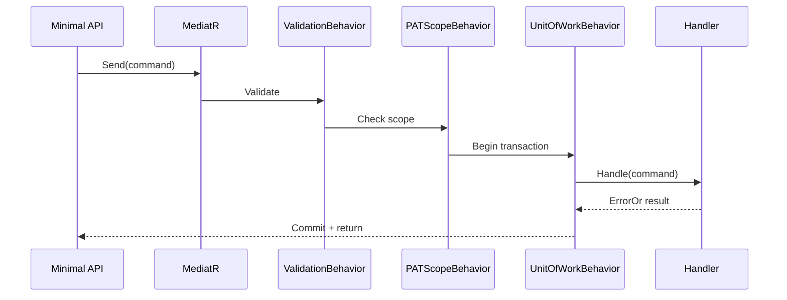

# CQRS Handlers

## Pattern Overview

Every operation in InfraFlowSculptor is either a **Command** (write) or a **Query** (read), dispatched through MediatR.



---

## Marker Interfaces

```csharp
// Command (write operation)
public interface ICommand<TResponse> : IRequest<ErrorOr<TResponse>>;

// Query (read operation)  
public interface IQuery<TResponse> : IRequest<ErrorOr<TResponse>>;

// Generation-specific command (requires Generate PAT scope)
public interface IGenerateCommand<TResponse> : ICommand<TResponse>;
```

---

## Folder Structure Convention

```
Application/
└── {Feature}/
    ├── Commands/
    │   ├── Create{Feature}/
    │   │   ├── Create{Feature}Command.cs        → ICommand<TResponse>
    │   │   ├── Create{Feature}CommandHandler.cs  → ICommandHandler<TCommand, TResponse>
    │   │   └── Create{Feature}CommandValidator.cs → AbstractValidator<TCommand>
    │   ├── Update{Feature}/
    │   │   └── ...
    │   └── Delete{Feature}/
    │       └── ...
    └── Queries/
        ├── Get{Feature}/
        │   ├── Get{Feature}Query.cs              → IQuery<TResponse>
        │   └── Get{Feature}QueryHandler.cs       → IQueryHandler<TQuery, TResponse>
        └── List{Features}/
            └── ...
```

---

## Command Example

```csharp
/// <summary>Creates a new Container App resource.</summary>
public sealed record CreateContainerAppCommand(
    Guid InfrastructureConfigId,
    Guid ResourceGroupId,
    string Name,
    string Image,
    int CpuCores,
    decimal Memory,
    int MinReplicas,
    int MaxReplicas,
    bool IsExisting) : ICommand<string>;
```

### Handler Example

```csharp
/// <summary>Handles creation of a Container App resource.</summary>
internal sealed class CreateContainerAppCommandHandler
    : ICommandHandler<CreateContainerAppCommand, string>
{
    private readonly IContainerAppRepository _repository;
    private readonly IInfraConfigAccessService _accessService;

    public CreateContainerAppCommandHandler(
        IContainerAppRepository repository,
        IInfraConfigAccessService accessService)
    {
        _repository = repository;
        _accessService = accessService;
    }

    public async Task<ErrorOr<string>> Handle(
        CreateContainerAppCommand request,
        CancellationToken cancellationToken)
    {
        // 1. Verify access
        var accessResult = await _accessService
            .VerifyWriteAccessAsync(
                new InfrastructureConfigId(request.InfrastructureConfigId),
                cancellationToken);
        if (accessResult.IsError) return accessResult.Errors;

        // 2. Create aggregate
        var resource = ContainerApp.Create(
            AzureResourceId.CreateNew(),
            new ResourceGroupId(request.ResourceGroupId),
            request.Name,
            request.Image,
            request.CpuCores,
            request.Memory);

        // 3. Persist (NO SaveChangesAsync - UoW handles it)
        await _repository.AddAsync(resource, cancellationToken);

        // 4. Return ID
        return resource.Id.Value.ToString();
    }
}
```

---

## Query Example

```csharp
/// <summary>Gets a Container App by its identifier.</summary>
public sealed record GetContainerAppQuery(
    Guid InfrastructureConfigId,
    Guid ResourceId) : IQuery<ContainerAppResponse>;
```

### Query Handler Example

```csharp
/// <summary>Reads a Container App resource.</summary>
internal sealed class GetContainerAppQueryHandler
    : IQueryHandler<GetContainerAppQuery, ContainerAppResponse>
{
    private readonly IContainerAppReadRepository _repository;
    private readonly IInfraConfigAccessService _accessService;

    public async Task<ErrorOr<ContainerAppResponse>> Handle(
        GetContainerAppQuery request,
        CancellationToken cancellationToken)
    {
        var accessResult = await _accessService
            .VerifyReadAccessAsync(
                new InfrastructureConfigId(request.InfrastructureConfigId),
                cancellationToken);
        if (accessResult.IsError) return accessResult.Errors;

        var resource = await _repository
            .GetByIdAsync(
                new AzureResourceId(request.ResourceId),
                cancellationToken);

        return resource is null
            ? Errors.Resource.NotFound
            : resource; // Implicit Mapster conversion
    }
}
```

---

## Pipeline Behaviors (Execution Order)

| Order | Behavior | Purpose |
|-------|----------|---------|
| 1 | `ValidationBehavior<,>` | Runs FluentValidation, short-circuits on failure |
| 2 | `PersonalAccessTokenScopeBehavior<,>` | Validates PAT scope against command type |
| 3 | `UnitOfWorkBehavior<,>` | Wraps command in transaction, calls SaveChanges |
| 4 | Handler | Actual business logic |

### Unit of Work Behavior

```csharp
// Only wraps ICommand (not IQuery)
// Auto-commits on success, no explicit SaveChangesAsync in handlers
public async Task<ErrorOr<TResponse>> Handle(...)
{
    var result = await next();
    
    if (!result.IsError && request is ICommand<TResponse>)
    {
        await _dbContext.SaveChangesAsync(cancellationToken);
    }
    
    return result;
}
```

> **CRITICAL:** Repositories MUST NOT call `SaveChangesAsync()`. The Unit of Work behavior handles it.

---

## Key Rules

1. **One handler per file** — Never group handlers
2. **Internal sealed** — Handlers are not public
3. **ErrorOr return** — No exceptions for business errors
4. **Access check first** — Always verify access before any read/write
5. **No SaveChanges** — Unit of Work handles persistence
6. **CancellationToken** — Propagated to all async calls
7. **XML documentation** — On every public record/class
