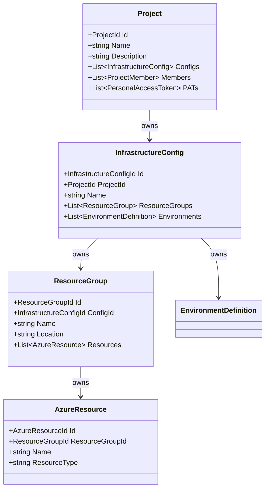
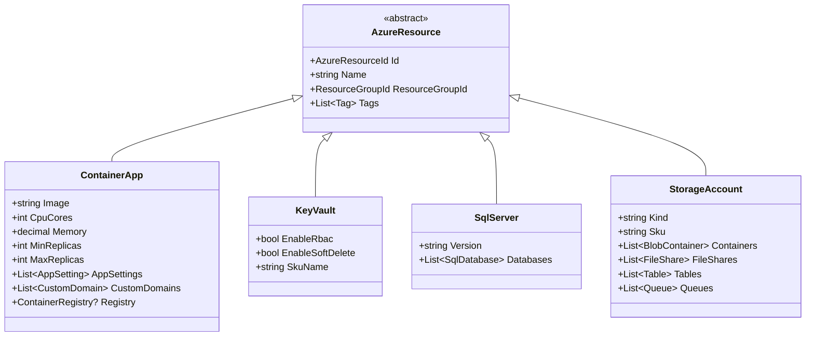
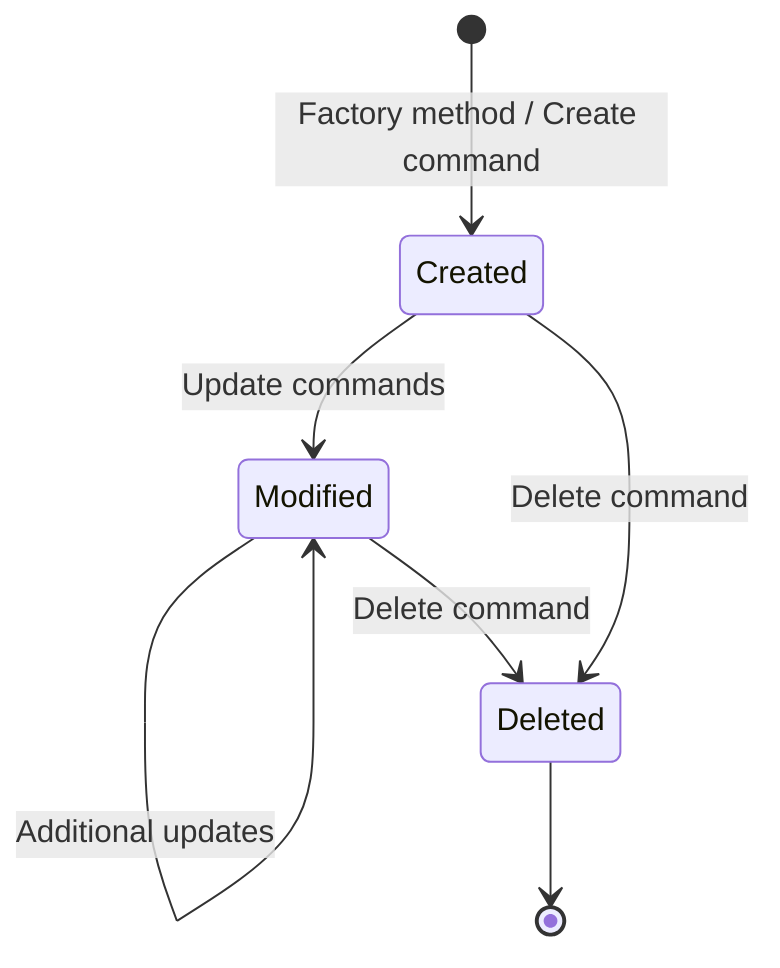
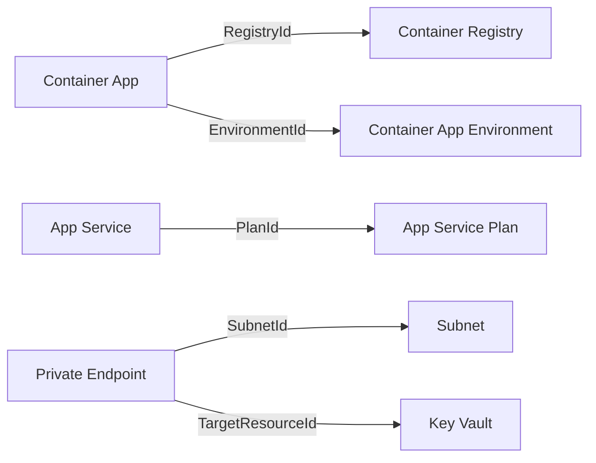

# Domain Model

## Overview

The domain model follows **Domain-Driven Design (DDD)** with sealed aggregates, typed IDs, and rich behavior encapsulated within entities.

---

## Aggregate Hierarchy



---

## Resource Type Hierarchy (TPT Inheritance)



---

## All 22 Azure Resource Types

| Type | Aggregate | Key Properties |
|------|-----------|---------------|
| Container App | `ContainerApp` | Image, CPU, Memory, Replicas, Ingress, Secrets |
| Container App Environment | `ContainerAppEnvironment` | LogAnalytics, VNetId |
| Container Registry | `ContainerRegistry` | Sku, AdminUser |
| Key Vault | `KeyVault` | EnableRbac, SoftDelete, Sku |
| SQL Server | `SqlServer` | Version, Databases |
| SQL Database | `SqlDatabase` | Sku, MaxSize, Collation |
| Storage Account | `StorageAccount` | Kind, Sku, SubResources |
| Application Insights | `ApplicationInsights` | WorkspaceId, Type |
| Log Analytics Workspace | `LogAnalyticsWorkspace` | Sku, Retention |
| Service Bus | `ServiceBus` | Sku, Queues, Topics |
| Redis Cache | `RedisCache` | Sku, Capacity, Family |
| App Service Plan | `AppServicePlan` | Sku, Os, ZoneRedundant |
| App Service | `AppService` | PlanId, Runtime, AppSettings |
| Static Web App | `StaticWebApp` | Sku, Branch, BuildConfig |
| Virtual Network | `VirtualNetwork` | AddressSpace, Subnets |
| Subnet | `Subnet` | AddressPrefix, Delegations |
| Network Security Group | `NetworkSecurityGroup` | Rules |
| Private Endpoint | `PrivateEndpoint` | SubnetId, GroupIds |
| Private DNS Zone | `PrivateDnsZone` | VNetLinks |
| User Assigned Identity | `UserAssignedIdentity` | (minimal) |
| Cosmos DB Account | `CosmosDbAccount` | Kind, Consistency, Databases |
| Signal R | `SignalR` | Sku, ServiceMode |

---

## Value Objects

| Value Object | Purpose | Example Values |
|-------------|---------|---------------|
| `ProjectId` | Typed project identifier | `Guid` wrapper |
| `InfrastructureConfigId` | Typed config identifier | `Guid` wrapper |
| `ResourceGroupId` | Typed RG identifier | `Guid` wrapper |
| `AzureResourceId` | Typed resource identifier | `Guid` wrapper |
| `EnvironmentId` | Typed environment identifier | `Guid` wrapper |
| `Tag` | Key-value metadata | `"Environment" = "Production"` |
| `AppSetting` | Application configuration | `"DB_HOST" = "@vault(connStr)"` |
| `CustomDomain` | DNS binding | `"api.contoso.com"` |
| `EnvironmentValue` | Per-env setting override | `"dev": "localhost"` |

---

## Aggregate Design Principles

1. **Sealed classes** — No inheritance outside the aggregate boundary
2. **Private setters** — All state changes through methods
3. **`= []` initializers** — Collections always initialized
4. **XML documentation** — On public members
5. **Domain errors** — Defined in `Common/Errors/` as static `Error` factories
6. **No external dependencies** — Domain assembly has zero NuGet packages
7. **English error messages** — Consistent language for logs and API
8. **Typed IDs** — Never use raw `Guid` in domain model

---

## Entity Lifecycle



### Creation Patterns

All aggregates use static factory methods:

```csharp
public sealed class ContainerApp : AzureResource
{
    /// <summary>Creates a new Container App resource.</summary>
    public static ContainerApp Create(
        AzureResourceId id,
        ResourceGroupId resourceGroupId,
        string name,
        string image,
        int cpuCores,
        decimal memory)
    {
        // Validation and initialization
    }
}
```

### Modification Patterns

Updates are explicit methods, not property setters:

```csharp
public void UpdateScaling(int minReplicas, int maxReplicas)
{
    if (minReplicas > maxReplicas)
        throw new DomainException("Min replicas cannot exceed max replicas");
    
    MinReplicas = minReplicas;
    MaxReplicas = maxReplicas;
}
```

---

## Cross-Aggregate References

Resources can reference other resources via `AzureResourceId`:



These cross-references drive the Bicep engine's cross-config reference resolution and the `existing` resource declarations in generated code.
