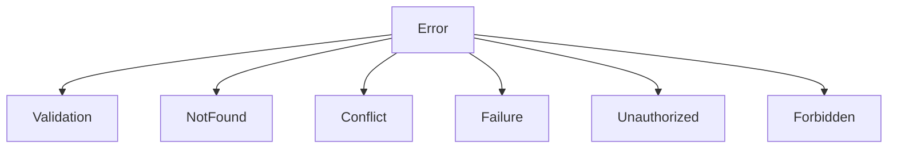

# Error Handling

## ErrorOr Pattern

InfraFlowSculptor uses the **ErrorOr** library as the primary error-handling mechanism, avoiding exceptions for expected business scenarios.

---

## Why ErrorOr?

| Approach | Problem |
|----------|---------|
| Exceptions | Expensive, non-local control flow, hard to compose |
| Result<T> | Standard but verbose, no built-in error taxonomy |
| **ErrorOr<T>** | Typed errors, composable, short-circuit operators, .NET idiomatic |

---

## Error Types



| Type | HTTP Code | When |
|------|-----------|------|
| `Validation` | 400 | Input validation failed |
| `NotFound` | 404 | Resource does not exist |
| `Conflict` | 409 | Duplicate or concurrent modification |
| `Failure` | 500 | Unexpected domain error |
| `Unauthorized` | 401 | Not authenticated |
| `Forbidden` | 403 | Insufficient permissions |

---

## Defining Domain Errors

Errors are defined as static factories in `Domain/Common/Errors/`:

```csharp
/// <summary>Errors for Container App operations.</summary>
public static class Errors
{
    public static class ContainerApp
    {
        public static Error NotFound => Error.NotFound(
            "ContainerApp.NotFound",
            "The container app was not found.");

        public static Error MinExceedsMax => Error.Validation(
            "ContainerApp.MinExceedsMax",
            "Minimum replicas cannot exceed maximum replicas.");

        public static Error NameAlreadyExists(string name) => Error.Conflict(
            "ContainerApp.NameAlreadyExists",
            $"A container app with name '{name}' already exists.");
    }
}
```

---

## Using ErrorOr in Handlers

```csharp
public async Task<ErrorOr<string>> Handle(
    CreateContainerAppCommand request,
    CancellationToken cancellationToken)
{
    // Access check returns ErrorOr<Success>
    var access = await _accessService.VerifyWriteAccessAsync(configId, cancellationToken);
    if (access.IsError) return access.Errors;

    // Domain operation might fail
    var result = aggregate.UpdateScaling(request.Min, request.Max);
    if (result.IsError) return result.Errors;

    return aggregate.Id.Value.ToString();
}
```

---

## HTTP Error Mapping

The API layer maps `ErrorOr` results to HTTP responses:

```csharp
// Extension method pattern
static IResult ToApiResult<T>(this ErrorOr<T> result)
{
    if (!result.IsError)
        return Results.Ok(result.Value);

    var firstError = result.FirstError;
    return firstError.Type switch
    {
        ErrorType.Validation => Results.ValidationProblem(...),
        ErrorType.NotFound => Results.NotFound(...),
        ErrorType.Conflict => Results.Conflict(...),
        ErrorType.Unauthorized => Results.Unauthorized(),
        ErrorType.Forbidden => Results.Forbid(),
        _ => Results.Problem(statusCode: 500)
    };
}
```

---

## Exception Handling (Non-Business Errors)

For unexpected infrastructure errors (database failures, network issues), the global exception handler middleware returns a 500:

```csharp
// GlobalExceptionHandlerMiddleware
app.UseExceptionHandler(errorApp =>
{
    errorApp.Run(async context =>
    {
        context.Response.StatusCode = 500;
        await context.Response.WriteAsJsonAsync(new ProblemDetails
        {
            Status = 500,
            Title = "An unexpected error occurred"
        });
    });
});
```

---

## Key Rules

1. **Never throw for business logic** — Use ErrorOr
2. **Define errors in Domain** — Not in Application or Infrastructure
3. **English messages** — Consistent for logs
4. **Error codes** — Use `"Entity.ErrorName"` format
5. **Short-circuit** — Return immediately on first error
6. **No catch-all handlers in business code** — Let infrastructure handle unexpected failures
