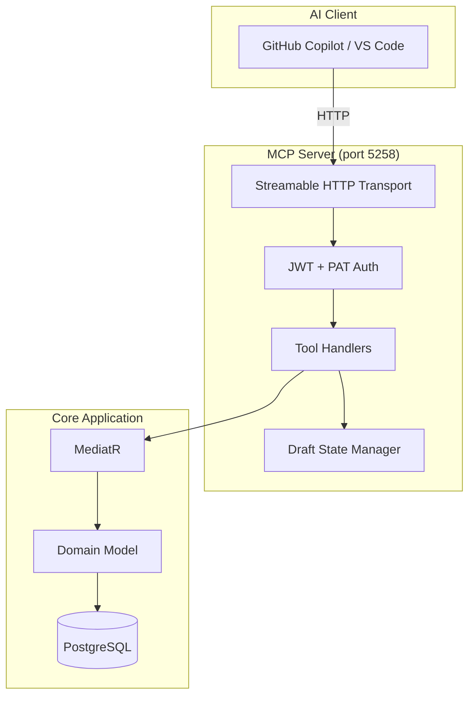
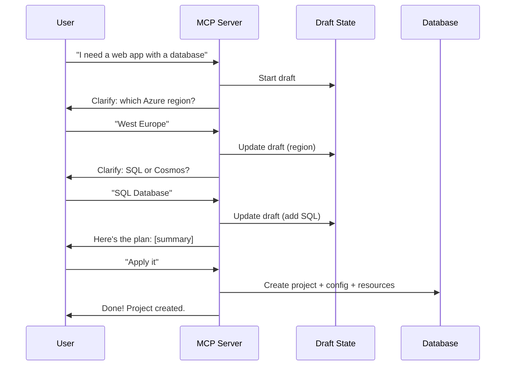

# MCP Server

## Overview

The **Model Context Protocol (MCP)** server enables AI agents to interact with InfraFlowSculptor programmatically — creating projects, configuring resources, and generating infrastructure as code through a conversational interface.

---

## Architecture



---

## Transport & Authentication

| Aspect | Configuration |
|--------|--------------|
| Transport | Streamable HTTP (port 5258) |
| Auth | Same as API: Entra ID JWT + PAT |
| Sessions | Stateless per-request |
| Draft state | In-memory per user session |

---

## Available Tools

### Project Management

| Tool | Description | Input |
|------|-------------|-------|
| `create_project` | Create a new IFS project | name, description |
| `list_projects` | List user's projects | — |
| `get_project` | Get project details | projectId |

### Infrastructure Configuration

| Tool | Description | Input |
|------|-------------|-------|
| `create_config` | Create infrastructure config | projectId, name |
| `add_resource_group` | Add resource group | configId, name, location |
| `add_resource` | Add Azure resource | rgId, type, properties |
| `update_resource` | Modify resource settings | resourceId, properties |

### Generation

| Tool | Description | Input |
|------|-------------|-------|
| `generate_bicep` | Generate Bicep for a config | configId, environments |
| `generate_pipeline` | Generate pipeline YAML | configId, options |
| `preview_generation` | Dry-run generation | configId |

### Draft / Conversational Flow

| Tool | Description | Input |
|------|-------------|-------|
| `start_draft` | Begin conversational project creation | intent description |
| `clarify` | Ask user a clarification question | question, options |
| `apply_draft` | Commit draft to database | draftId |
| `discard_draft` | Cancel draft | draftId |

---

## Conversational Project Creation

The MCP server supports a **draft-based** conversational flow:



---

## OpenTelemetry

MCP tool invocations emit traces visible in the Aspire Dashboard:

- Source: `Experimental.ModelContextProtocol`, `ModelContextProtocol`, `ModelContextProtocol.Core`
- Each tool call appears as a distinct span
- Errors propagate through standard OTel error attributes

---

## VS Code Integration

```json
// .vscode/mcp.json
{
  "servers": {
    "infraflowsculptor": {
      "type": "http",
      "url": "http://localhost:5258/mcp",
      "headers": {
        "Authorization": "Bearer ${input:mcpToken}"
      }
    }
  }
}
```

---

## Key Design Decisions

| Decision | Rationale |
|----------|-----------|
| HTTP transport (not stdio) | Multi-user, stateless, deployable |
| Same auth as API | Single security model |
| Draft pattern | Non-destructive conversational UX |
| Reuses MediatR | No duplication of business logic |
| Separate project (`src/Mcp/`) | Independent deployment lifecycle |
