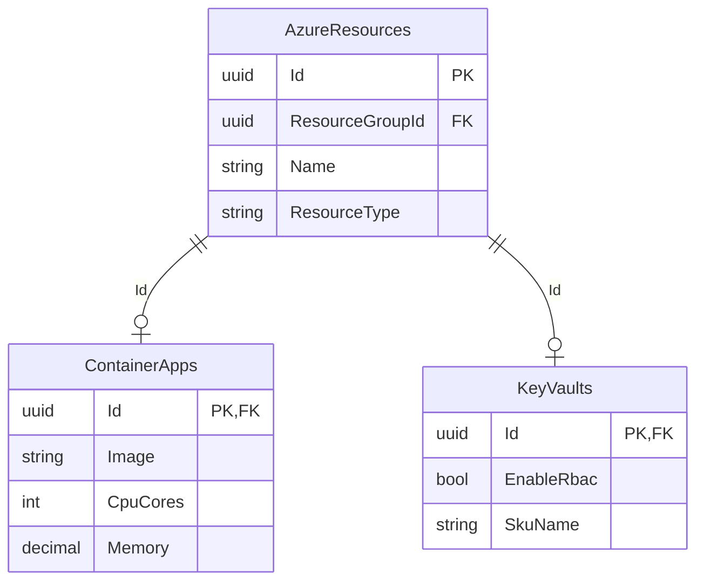

# Persistence Layer

## Overview

Persistence uses **EF Core 10** with **PostgreSQL 17.6**, following the repository pattern with dedicated read/write repositories.

---

## Database Context

```csharp
public sealed class ProjectDbContext : DbContext
{
    // All aggregate DbSets
    public DbSet<Project> Projects { get; set; }
    public DbSet<InfrastructureConfig> InfrastructureConfigs { get; set; }
    public DbSet<ResourceGroup> ResourceGroups { get; set; }
    public DbSet<ContainerApp> ContainerApps { get; set; }
    // ... 22 resource types
}
```

---

## Entity Configuration Pattern

Each entity has a dedicated `IEntityTypeConfiguration<T>`:

```csharp
public sealed class ContainerAppConfiguration 
    : IEntityTypeConfiguration<ContainerApp>
{
    public void Configure(EntityTypeBuilder<ContainerApp> builder)
    {
        builder.ToTable("ContainerApps"); // TPT table

        builder.HasKey(x => x.Id);
        
        builder.Property(x => x.Id)
            .HasConversion<AzureResourceIdConverter>();

        builder.Property(x => x.Name)
            .HasMaxLength(128)
            .IsRequired();

        builder.HasMany(x => x.AppSettings)
            .WithOne()
            .HasForeignKey("ContainerAppId")
            .OnDelete(DeleteBehavior.Cascade);
    }
}
```

---

## TPT (Table-Per-Type) Inheritance



Each concrete resource type has its own table sharing the `Id` primary key with the base `AzureResources` table.

---

## Value Object Converters

Typed IDs are converted to/from `Guid`:

```csharp
public sealed class AzureResourceIdConverter 
    : ValueConverter<AzureResourceId, Guid>
{
    public AzureResourceIdConverter()
        : base(id => id.Value, guid => new AzureResourceId(guid))
    { }
}
```

Registered globally via `ConfigureConventions()`.

---

## Repository Pattern

### Write Repository (Aggregate Root)

```csharp
public interface IContainerAppRepository
{
    Task<ContainerApp?> GetByIdAsync(AzureResourceId id, CancellationToken ct);
    Task AddAsync(ContainerApp entity, CancellationToken ct);
    void Remove(ContainerApp entity);
    // NO SaveChangesAsync — UoW handles it
}
```

### Read Repository (Projections)

```csharp
public interface IContainerAppReadRepository
{
    Task<ContainerAppResponse?> GetByIdAsync(
        AzureResourceId id, CancellationToken ct);
    Task<IReadOnlyList<ContainerAppListResponse>> ListByConfigAsync(
        InfrastructureConfigId configId, CancellationToken ct);
}
```

Read repositories use `AsNoTracking()` and project directly to response DTOs.

---

## Concurrency Control

PostgreSQL `xmin` system column is used for optimistic concurrency:

```csharp
builder.UseXminAsConcurrencyToken();
```

No extra `RowVersion` column needed — PostgreSQL handles it natively.

---

## SQL Views

Complex read queries use database views:

| View | Purpose |
|------|---------|
| `vw_ProjectResources` | Flat list of all resources across configs |
| `vw_EnvironmentOverview` | Environment definitions with value counts |

---

## FK Cascade Strategy

| Relationship | Delete Behavior | Reason |
|-------------|----------------|--------|
| Project → InfraConfig | Cascade | Config belongs to project |
| InfraConfig → ResourceGroup | Cascade | RG belongs to config |
| ResourceGroup → Resource | Cascade | Resource belongs to RG |
| Resource → Sub-resource | Cascade | Sub-resource is owned |
| Cross-resource FK | SetNull | Independent lifecycle |

---

## Migration Strategy

- Migrations generated via `dotnet ef migrations add`
- Applied at startup via `context.Database.MigrateAsync()`
- Naming: `YYYYMMDD_Description` format
- No data migrations in EF migrations — use seed scripts

---

## Performance Patterns

| Pattern | Where | Impact |
|---------|-------|--------|
| `AsNoTracking()` | All read repos | No change tracker overhead |
| `Include()` helpers | Write repos | Shared eager-loading |
| Targeted queries | StorageAccount sub-resources | 3 queries vs N+1 |
| UPSERT | User provisioning | Race-free creation |
| `AsSplitQuery()` | Deep aggregates | Avoids cartesian explosion |
