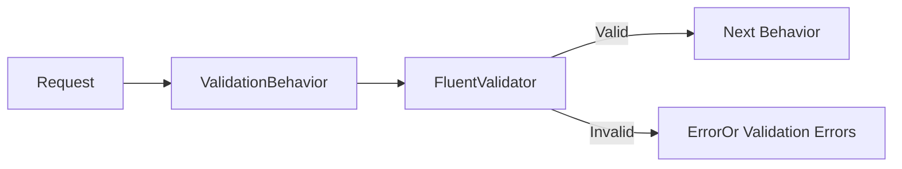

# Validation

## Strategy

Input validation is enforced by **FluentValidation** at the pipeline behavior level, before any handler logic executes.

---

## Architecture



The `ValidationBehavior<TRequest, TResponse>` automatically discovers and runs all validators registered for the request type.

---

## Validator Structure

```csharp
/// <summary>Validates the CreateContainerApp command.</summary>
public sealed class CreateContainerAppCommandValidator
    : AbstractValidator<CreateContainerAppCommand>
{
    public CreateContainerAppCommandValidator()
    {
        RuleFor(x => x.Name)
            .NotEmpty()
            .MaximumLength(128);

        RuleFor(x => x.Image)
            .NotEmpty()
            .MaximumLength(512);

        RuleFor(x => x.CpuCores)
            .InclusiveBetween(1, 16);

        RuleFor(x => x.Memory)
            .GreaterThan(0)
            .LessThanOrEqualTo(32);

        RuleFor(x => x.MinReplicas)
            .GreaterThanOrEqualTo(0);

        RuleFor(x => x.MaxReplicas)
            .GreaterThanOrEqualTo(1)
            .GreaterThanOrEqualTo(x => x.MinReplicas);
    }
}
```

---

## Conventions

| Rule | Convention |
|------|-----------|
| File name | `{Command}Validator.cs` |
| Location | Same folder as the command |
| Class | `sealed`, no inheritance |
| Registration | Auto-discovered by `AddValidatorsFromAssembly()` |
| Custom messages | English, concise, actionable |

---

## Validation Error Mapping

When validation fails, errors are returned as `ErrorOr<T>` with type `Validation`:

```csharp
// In ValidationBehavior
var errors = validationResults
    .Where(vr => !vr.IsValid)
    .SelectMany(vr => vr.Errors)
    .Select(f => Error.Validation(f.PropertyName, f.ErrorMessage))
    .ToList();

return errors; // Short-circuits, handler never executes
```

The API layer maps these to HTTP 400 with a problem details response.

---

## Domain-Level Validation

Beyond FluentValidation (input layer), the domain model enforces **invariants**:

| Layer | Type | When |
|-------|------|------|
| Application (FluentValidation) | Input shape | Before handler |
| Domain (guard clauses) | Business rules | Inside aggregate methods |
| Infrastructure (EF Core) | Schema constraints | At persistence time |

```csharp
// Domain guard clause
public void UpdateScaling(int min, int max)
{
    if (min > max)
        return Errors.ContainerApp.MinExceedsMax; // ErrorOr
}
```

---

## Tag Validation (Centralized)

Tags follow centralized constraints (`TagRequestConstraints`):

| Constraint | Value |
|-----------|-------|
| Max key length | 512 |
| Max value length | 256 |
| Max tags per resource | 15 |

Applied uniformly across all resource Create/Update validators.
