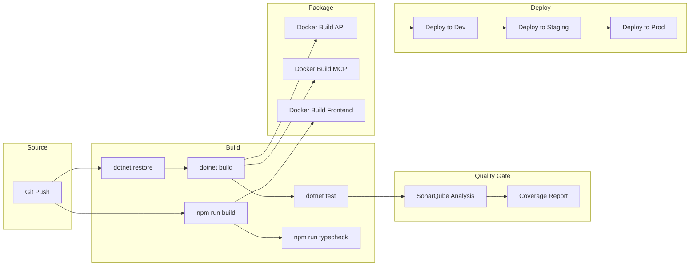

# CI/CD Pipeline

## Pipeline Architecture



---

## Build Steps

### Backend

```powershell
# Restore
dotnet restore .\InfraFlowSculptor.slnx

# Build
dotnet build .\InfraFlowSculptor.slnx --no-restore

# Test
dotnet test .\InfraFlowSculptor.slnx --no-build --collect:"XPlat Code Coverage"
```

### Frontend

```powershell
cd src\Front
npm ci
npm run typecheck
npm run build -- --configuration production
```

---

## Quality Gates

| Gate | Tool | Threshold |
|------|------|-----------|
| Unit tests | xUnit | All pass |
| Type checking | TypeScript | Zero errors |
| Code coverage | Coverlet | > 80% |
| Code quality | SonarQube | No new bugs/vulnerabilities |
| Build | dotnet build | Zero warnings (TreatWarningsAsErrors) |

---

## Branch Strategy

| Branch | Purpose | Deploys To |
|--------|---------|-----------|
| `main` | Production-ready | Production |
| `develop` | Integration | Staging |
| `feature/*` | Feature work | — (PR only) |
| `fix/*` | Bug fixes | — (PR only) |
| `docs/*` | Documentation | — |

---

## PR Requirements

- All tests pass
- Type check passes
- SonarQube quality gate passes
- At least 1 reviewer approval
- No merge conflicts
- Conventional commit title (`type(scope): description`)
