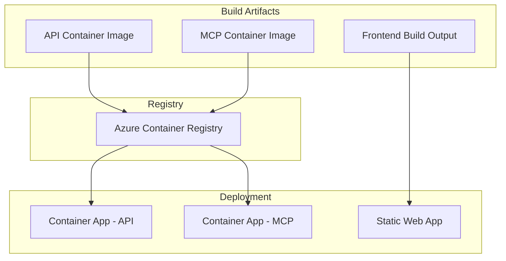

# Deployment

## Deployment Targets

| Service | Target | Strategy |
|---------|--------|----------|
| API | Azure Container App | Rolling update |
| MCP Server | Azure Container App | Rolling update |
| Frontend | Azure Static Web App | Atomic deploy |
| Database | Azure PostgreSQL Flexible | Managed |

---

## Deployment Flow



---

## Container App Configuration

### API

```yaml
properties:
  configuration:
    ingress:
      external: true
      targetPort: 8080
    secrets:
      - name: db-connection
        keyVaultUrl: https://<kv>.vault.azure.net/secrets/db-connection
  template:
    containers:
      - name: api
        image: <acr>.azurecr.io/infraflowsculptor-api:latest
        resources:
          cpu: 0.5
          memory: 1Gi
        env:
          - name: ConnectionStrings__infraDb
            secretRef: db-connection
    scale:
      minReplicas: 1
      maxReplicas: 5
      rules:
        - name: http-scaling
          http:
            metadata:
              concurrentRequests: "50"
```

---

## Database Migrations

Migrations run automatically at application startup:
```csharp
await context.Database.MigrateAsync();
```

For breaking schema changes, a staged deployment is required:
1. Deploy new code with backward-compatible schema
2. Run data migration
3. Deploy code that uses new schema
4. Drop old columns/tables

---

## Rollback Procedure

| Component | Rollback Method |
|-----------|----------------|
| API / MCP | Revision rollback in Container App |
| Frontend | Redeploy previous build |
| Database | Point-in-time restore (last resort) |

---

## Health Check Verification

After deployment, verify health:
```bash
curl https://api.infraflowsculptor.com/health
curl https://api.infraflowsculptor.com/alive
```

Expected: HTTP 200 with `Healthy` status.
