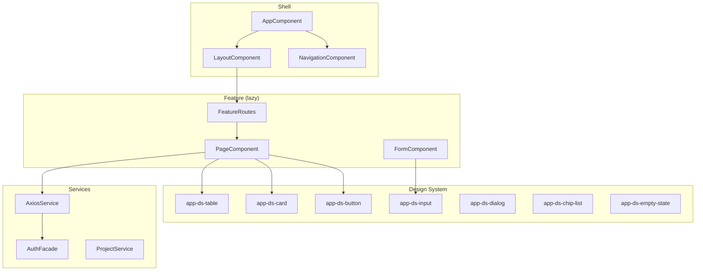

# Frontend Architecture

## Project Structure

```
src/Front/src/
├── app/
│   ├── core/                    → Singletons (auth, guards, interceptors)
│   │   ├── auth/                → AuthFacade, guards, MSAL config
│   │   └── services/            → Global singleton services
│   ├── shared/                  → Reusable across features
│   │   ├── components/
│   │   │   └── ds/              → Design System components (app-ds-*)
│   │   ├── models/              → Shared TypeScript interfaces
│   │   ├── services/            → Shared utilities
│   │   └── pipes/               → Shared pipes
│   ├── features/                → Feature modules (lazy-loaded)
│   │   ├── project/             → Project CRUD + overview
│   │   ├── infrastructure/      → InfraConfig management
│   │   ├── resources/           → Azure resource editors
│   │   ├── generation/          → Bicep/Pipeline generation UI
│   │   ├── environments/        → Environment management
│   │   └── settings/            → User/project settings
│   ├── app.component.ts         → Root component
│   ├── app.config.ts            → App configuration (providers)
│   └── app.routes.ts            → Top-level routes
├── assets/
│   └── i18n/                    → Translation JSON files
├── environments/                → Environment configs
└── styles/                      → Global SCSS + Tailwind
```

---

## Component Architecture



---

## Standalone Components

All components are standalone (no NgModules):

```typescript
@Component({
  selector: 'app-resource-list',
  standalone: true,
  imports: [
    DsCardComponent,
    DsButtonComponent,
    DsEmptyStateComponent,
    TranslateModule,
  ],
  templateUrl: './resource-list.component.html',
})
export class ResourceListComponent {
  private readonly projectService = inject(ProjectService);
  
  readonly resources = signal<ResourceListItem[]>([]);
  readonly loading = signal(true);
}
```

---

## State Management (Signals)

No external state management library. Angular signals manage component state:

```typescript
// Component-level state
readonly projects = signal<ProjectSummary[]>([]);
readonly selectedProject = signal<ProjectDetail | null>(null);
readonly loading = signal(false);
readonly error = signal<string | null>(null);

// Computed state
readonly hasProjects = computed(() => this.projects().length > 0);
readonly filteredProjects = computed(() => 
  this.projects().filter(p => p.name.includes(this.searchTerm()))
);
```

---

## Lazy Loading

Feature modules are lazy-loaded via route configuration:

```typescript
export const routes: Routes = [
  {
    path: 'projects',
    loadChildren: () => import('./features/project/project.routes')
      .then(m => m.PROJECT_ROUTES),
    canActivate: [authGuard],
  },
  {
    path: 'infrastructure/:configId',
    loadChildren: () => import('./features/infrastructure/infrastructure.routes')
      .then(m => m.INFRASTRUCTURE_ROUTES),
    canActivate: [authGuard],
  },
];
```

---

## Key Rules

1. **One class per file** — Never multiple components/services in one file
2. **Standalone** — No NgModules, ever
3. **Signals** — No BehaviorSubject for state
4. **DS components** — Use `app-ds-*` for all UI primitives
5. **Strong typing** — No `any`, no `Record<string, unknown>`
6. **inject()** — Function-based injection, not constructor DI
7. **Enums/constants** — No magic strings in templates or logic
