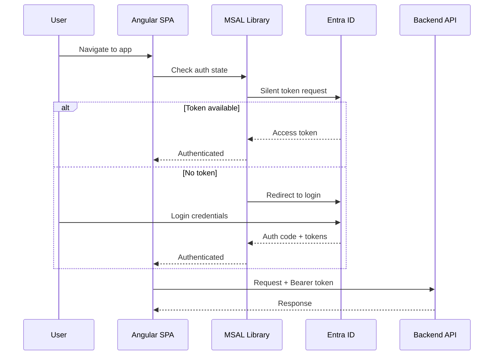

# Frontend Authentication

## Overview

Authentication uses **MSAL (Microsoft Authentication Library)** for Angular, integrating with Azure AD / Entra ID.

---

## Architecture



---

## AuthFacade

The `AuthFacade` service provides a clean API over MSAL:

```typescript
@Injectable({ providedIn: 'root' })
export class AuthFacade {
  private readonly msalService = inject(MsalService);
  
  readonly isAuthenticated = signal(false);
  readonly user = signal<UserInfo | null>(null);
  
  async login(): Promise<void> { ... }
  async logout(): Promise<void> { ... }
  async getAccessToken(): Promise<string> { ... }
}
```

---

## Guards

```typescript
export const authGuard: CanActivateFn = () => {
  const auth = inject(AuthFacade);
  const router = inject(Router);
  
  if (auth.isAuthenticated()) return true;
  return router.createUrlTree(['/login']);
};
```

---

## Token Attachment

The `AxiosService` attaches the Bearer token to all API requests:

```typescript
// Request interceptor
axios.interceptors.request.use(async (config) => {
  const token = await authFacade.getAccessToken();
  if (token) {
    config.headers.Authorization = `Bearer ${token}`;
  }
  return config;
});
```

---

## MSAL Configuration

```typescript
export const msalConfig: Configuration = {
  auth: {
    clientId: environment.clientId,
    authority: `https://login.microsoftonline.com/${environment.tenantId}`,
    redirectUri: environment.redirectUri,
  },
  cache: {
    cacheLocation: 'sessionStorage',
    storeAuthStateInCookie: false,
  },
};
```

---

## Protected Routes

All routes under `/projects`, `/infrastructure`, and `/settings` require authentication via `authGuard`.

Public routes:
- `/login` — Login page
- `/callback` — MSAL redirect callback
