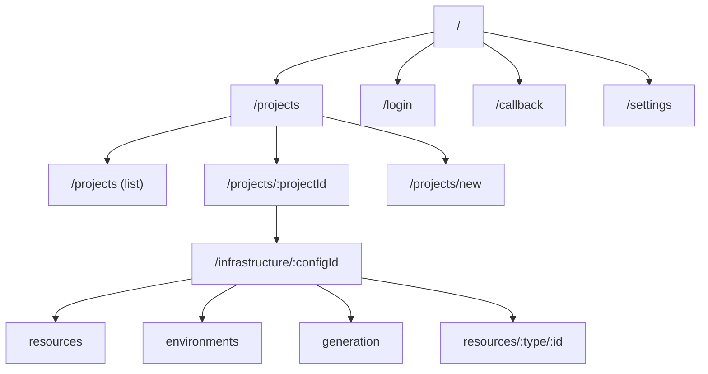

# Frontend Routing

## Overview

Routing uses Angular's standalone router with lazy-loaded feature routes and authentication guards.

---

## Top-Level Routes

```typescript
export const routes: Routes = [
  { path: '', redirectTo: 'projects', pathMatch: 'full' },
  { path: 'login', component: LoginComponent },
  { path: 'callback', component: CallbackComponent },
  {
    path: 'projects',
    loadChildren: () => import('./features/project/project.routes')
      .then(m => m.PROJECT_ROUTES),
    canActivate: [authGuard],
  },
  {
    path: 'infrastructure/:configId',
    loadChildren: () => import('./features/infrastructure/infrastructure.routes')
      .then(m => m.INFRASTRUCTURE_ROUTES),
    canActivate: [authGuard],
  },
  {
    path: 'settings',
    loadChildren: () => import('./features/settings/settings.routes')
      .then(m => m.SETTINGS_ROUTES),
    canActivate: [authGuard],
  },
  { path: '**', redirectTo: 'projects' },
];
```

---

## Route Structure



---

## Guards

| Guard | Purpose | Applied To |
|-------|---------|-----------|
| `authGuard` | Require authentication | All protected routes |
| `projectAccessGuard` | Verify project membership | Project detail routes |

---

## Lazy Loading Strategy

Each feature is a separate chunk loaded on demand:

| Chunk | Routes | Size Impact |
|-------|--------|-------------|
| `project` | Project CRUD | ~50KB |
| `infrastructure` | Config management | ~80KB |
| `resources` | Resource editors (22 types) | ~120KB |
| `generation` | Generation UI | ~40KB |
| `settings` | User settings | ~30KB |

---

## URL Parameters

| Parameter | Type | Example |
|-----------|------|---------|
| `:projectId` | UUID | `/projects/fb8699ea-f568-4afb-864b-e82d2efd0905` |
| `:configId` | UUID | `/infrastructure/a1b2c3d4-...` |
| `:resourceId` | UUID | `/resources/container-app/e5f6g7h8-...` |
| `:type` | slug | `container-app`, `key-vault`, `sql-server` |
