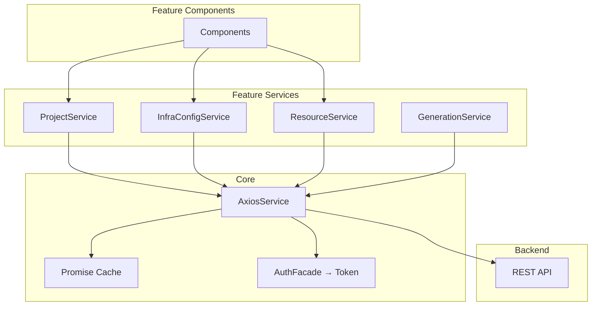

# Frontend Services

## HTTP Layer (Axios)

All HTTP communication goes through `AxiosService` which provides:

- Token attachment (Bearer)
- Response/error interceptors
- Base URL configuration
- Request cancellation

---

## Service Architecture



---

## Promise Cache + Coalescing

The `ProjectService` implements a caching layer:

```typescript
@Injectable({ providedIn: 'root' })
export class ProjectService {
  private cache = new Map<string, { data: any; expiry: number }>();
  private inflight = new Map<string, Promise<any>>();
  
  async getProjectResources(projectId: string): Promise<Resource[]> {
    const key = `resources:${projectId}`;
    
    // 1. Check cache (30s TTL)
    const cached = this.cache.get(key);
    if (cached && cached.expiry > Date.now()) return cached.data;
    
    // 2. Coalesce in-flight requests
    if (this.inflight.has(key)) return this.inflight.get(key)!;
    
    // 3. Make request
    const promise = this.axios.get<Resource[]>(`/projects/${projectId}/resources`);
    this.inflight.set(key, promise);
    
    try {
      const data = await promise;
      this.cache.set(key, { data, expiry: Date.now() + 30_000 });
      return data;
    } finally {
      this.inflight.delete(key);
    }
  }
  
  invalidateCache(projectId: string): void {
    // Called after mutations
    this.cache.delete(`resources:${projectId}`);
  }
}
```

---

## Service Conventions

| Rule | Convention |
|------|-----------|
| Injectable scope | `providedIn: 'root'` (singleton) |
| Return type | `Promise<T>` (not Observable) |
| Error handling | Let interceptor catch, component handles |
| Cache invalidation | Explicit after mutations |
| Typing | Full TypeScript interfaces, no `any` |
| Methods | Async/await, no `.then()` chains |

---

## Available Services

| Service | Responsibility |
|---------|---------------|
| `ProjectService` | CRUD projects, list resources |
| `InfraConfigService` | CRUD infrastructure configs |
| `ResourceService` | CRUD Azure resources (per type) |
| `GenerationService` | Trigger Bicep/Pipeline generation |
| `EnvironmentService` | Manage environments + values |
| `UserService` | User preferences, PAT management |
| `DownloadService` | File downloads (generated artifacts) |
