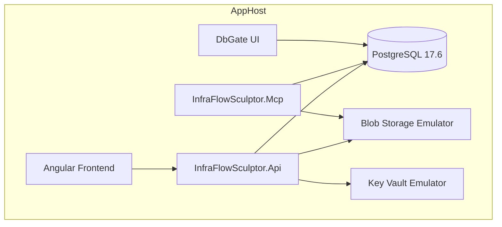

# Aspire Orchestration

## Overview

**.NET Aspire 13.3** orchestrates the entire local development stack from a single `AppHost` project.

---

## Resource Graph



---

## AppHost Configuration

```csharp
var builder = DistributedApplication.CreateBuilder(args);

// PostgreSQL
var postgres = builder.AddPostgres("postgres")
    .WithDataVolume()
    .WithPgAdmin();

var infraDb = postgres.AddDatabase("infraDb");

// API
var api = builder.AddProject<Projects.InfraFlowSculptor_Api>("api")
    .WithReference(infraDb)
    .WithExternalHttpEndpoints();

// MCP Server
var mcp = builder.AddProject<Projects.InfraFlowSculptor_Mcp>("mcp")
    .WithReference(infraDb)
    .WithExternalHttpEndpoints();

// Frontend
builder.AddNpmApp("frontend", "../Front")
    .WithReference(api)
    .WithExternalHttpEndpoints();

builder.Build().Run();
```

---

## Ports (Local)

| Service | Port | URL |
|---------|------|-----|
| Aspire Dashboard | 15888 | `http://localhost:15888` |
| API | 5102 | `http://localhost:5102` |
| MCP Server | 5258 | `http://localhost:5258` |
| Frontend | 4200 | `http://localhost:4200` |
| PostgreSQL | 5432 | `localhost:5432` |
| DbGate | 3000 | `http://localhost:3000` |

---

## Running

```powershell
# Start everything
dotnet run --project .\src\Aspire\InfraFlowSculptor.AppHost\InfraFlowSculptor.AppHost.csproj

# Or via Aspire CLI
aspire run
```

---

## Service Defaults

`InfraFlowSculptor.ServiceDefaults` provides shared configuration:
- OpenTelemetry exporters
- Health check endpoints
- Service discovery
- Resilience policies

Applied to both API and MCP projects via:
```csharp
builder.AddServiceDefaults();
```

---

## Key Benefits

| Benefit | Description |
|---------|-------------|
| **One command** | Entire stack starts with `aspire run` |
| **Dependency management** | PostgreSQL auto-provisioned with data volume |
| **Service discovery** | Inter-service URLs resolved automatically |
| **Observability** | All telemetry flows to Aspire Dashboard |
| **Consistent** | Same setup on every developer machine |
