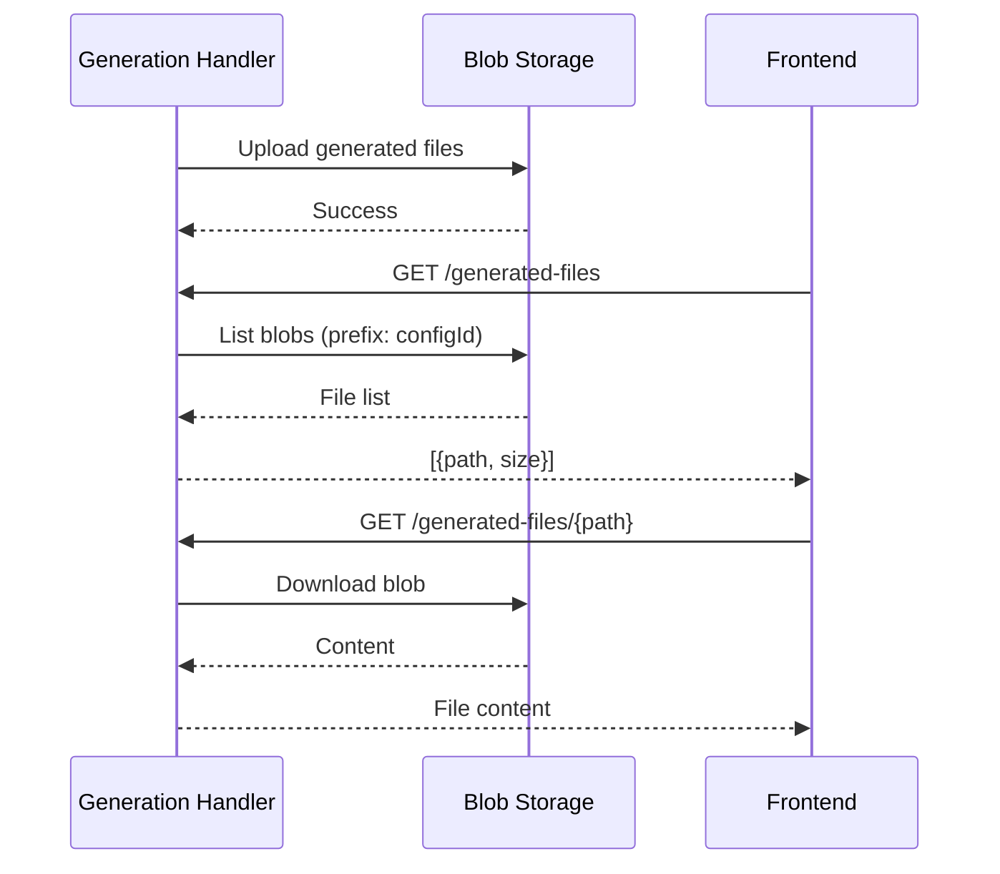

# Blob Storage

## Purpose

Azure Blob Storage stores **generated artifacts** (Bicep files, pipeline YAML) between generation and download/push.

---

## Container Structure

```
generated-artifacts/
├── {configId}/
│   ├── bicep/
│   │   ├── main.bicep
│   │   ├── modules/
│   │   │   ├── ContainerApp/containerapp.module.bicep
│   │   │   └── KeyVault/keyvault.module.bicep
│   │   └── parameters/
│   │       ├── dev.bicepparam
│   │       └── prod.bicepparam
│   └── pipelines/
│       ├── infrastructure-pipeline.yml
│       └── application-pipeline.yml
```

---

## Access Pattern



---

## Authentication

| Environment | Auth Method |
|-------------|-------------|
| Local (Aspire) | Azurite connection string |
| Production | Managed Identity (DefaultAzureCredential) |

---

## Lifecycle

| Event | Action |
|-------|--------|
| Generation triggered | Old artifacts deleted, new ones uploaded |
| Push to Git | Artifacts read from blob, pushed to DevOps |
| Config deleted | Associated blob prefix cleaned up |

---

## Configuration

```json
{
  "BlobStorage": {
    "ContainerName": "generated-artifacts",
    "ConnectionString": "<from-aspire-or-keyvault>"
  }
}
```
