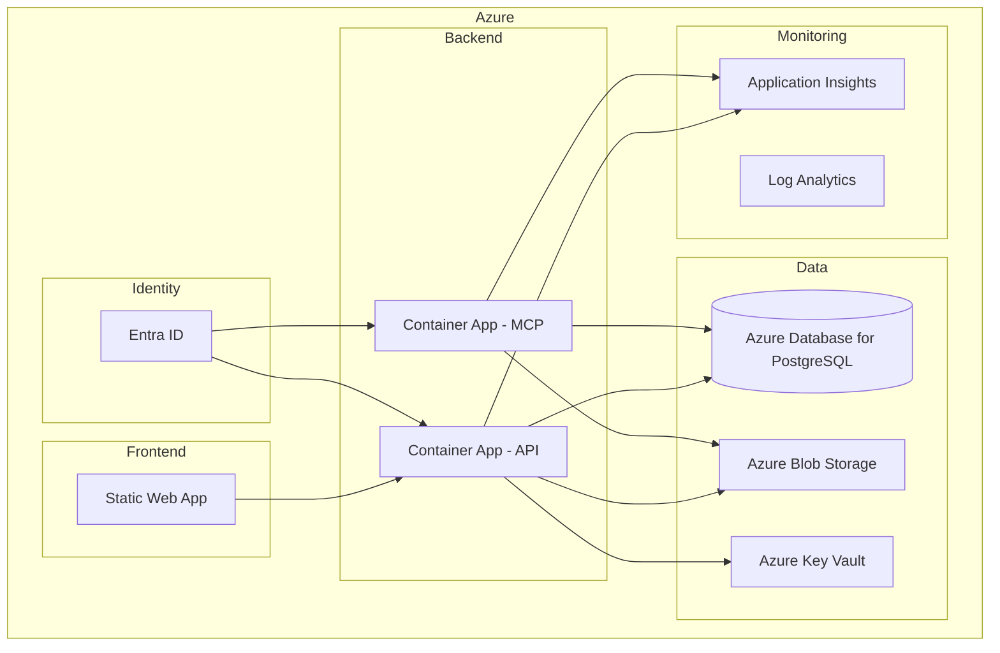

# Cloud Architecture

## Target Deployment

---

## Resource Mapping

| Component | Azure Resource | SKU |
|-----------|---------------|-----|
| API | Container App | Consumption |
| MCP Server | Container App | Consumption |
| Frontend | Static Web App | Standard |
| Database | Azure Database for PostgreSQL Flexible | Burstable B1ms |
| File Storage | Storage Account (Blob) | Standard LRS |
| Secrets | Key Vault | Standard |
| Monitoring | Application Insights | — |
| Logs | Log Analytics Workspace | Pay-per-GB |
| Auth | Entra ID | Standard (tenant-level) |

---

## Networking

| Flow | Protocol | Auth |
|------|----------|------|
| Browser → Frontend | HTTPS | — |
| Frontend → API | HTTPS | JWT Bearer |
| MCP Client → MCP | HTTPS | JWT / PAT |
| API → PostgreSQL | TCP 5432 | Managed Identity |
| API → Blob Storage | HTTPS | Managed Identity |
| API → Key Vault | HTTPS | Managed Identity |
| API → Azure DevOps | HTTPS | PAT |

---

## Environments

| Environment | Purpose | Database | Isolation |
|-------------|---------|----------|-----------|
| Development | Local Aspire | Docker PostgreSQL | Full |
| Staging | Pre-prod validation | Shared Flexible | Resource Group |
| Production | Live users | Dedicated Flexible | Subscription |
