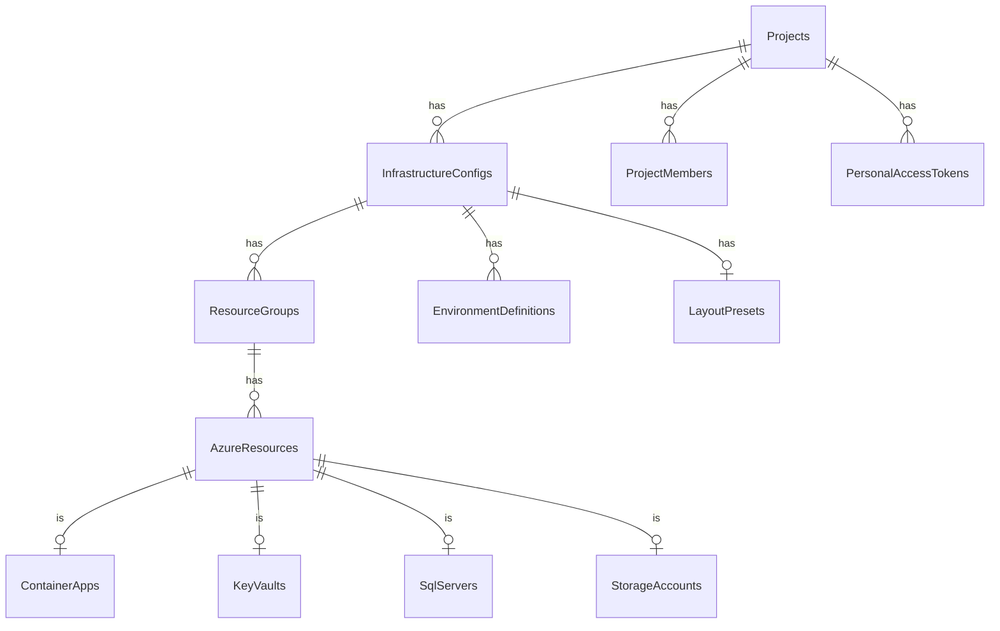

# Database

## PostgreSQL 17.6

InfraFlowSculptor uses PostgreSQL as the primary data store.

---

## Schema Overview



---

## Key Tables

| Table | Purpose | Rows (typical) |
|-------|---------|---------------|
| `Projects` | Top-level entities | 10-50 |
| `InfrastructureConfigs` | Deployment configurations | 20-100 |
| `ResourceGroups` | Azure resource groups | 50-200 |
| `AzureResources` | Base resource table (TPT) | 100-1000 |
| `ContainerApps` | Container App specifics | varies |
| `EnvironmentDefinitions` | dev/staging/prod | 3-5 per config |
| `EnvironmentValues` | Per-env overrides | 500-5000 |
| `PersonalAccessTokens` | MCP/automation tokens | 5-20 |
| `Users` | Provisioned users | 5-50 |

---

## Connection Management

### Local (Aspire)

Connection string auto-injected by Aspire service discovery:
```
Host=localhost;Port=5432;Database=infraDb;Username=postgres;Password=<auto>
```

### Production

Managed identity connection (no password):
```
Host=<server>.postgres.database.azure.com;Database=infraDb;Username=<managed-identity>
```

---

## Migrations

### Creating

```powershell
cd .\src\Api\InfraFlowSculptor.Infrastructure
dotnet ef migrations add 20250601_AddNewField `
  --startup-project ..\InfraFlowSculptor.Api
```

### Applying

Migrations auto-apply at startup via:
```csharp
await context.Database.MigrateAsync();
```

### Naming Convention

```
YYYYMMDD_DescriptiveNameInPascalCase
```

---

## Seeding

Local development seeding uses the SQL script:

```powershell
# Apply seed data
.\scripts\seed-project-snapshot.ps1
```

The seed file (`scripts/seed-project-snapshot.sql`) contains a complete project with all resource types for local testing.

---

## Performance Considerations

| Strategy | Implementation |
|----------|---------------|
| Connection pooling | Npgsql built-in pool |
| xmin concurrency | Native PostgreSQL, no extra columns |
| Targeted queries | Avoid full aggregate load for reads |
| AsNoTracking | All read repositories |
| Indexes | FK columns, resource type discriminator |
| AsSplitQuery | Deep hierarchies with collections |

---

## Backup Strategy

| Environment | Method | Retention |
|-------------|--------|-----------|
| Local | Docker volume + pg_dump | Manual |
| Production | Azure Database for PostgreSQL automatic | 7-35 days |
