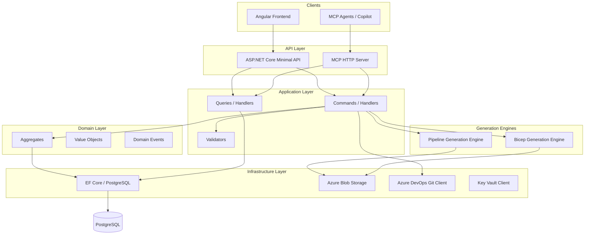
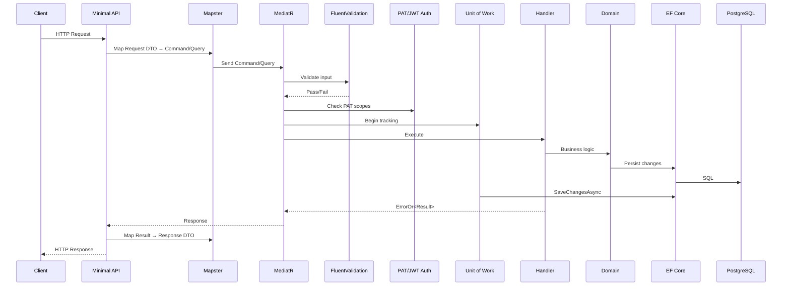
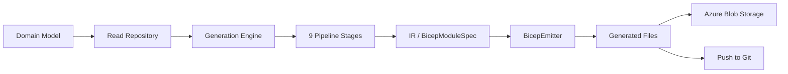

# Architecture Overview (Quick Mental Model)

> This page gives you a 5-minute understanding of how InfraFlowSculptor works.
> For deep dives, see the [Architecture](../architecture/README.md) section.

---

## The Big Picture

## Layered Architecture

InfraFlowSculptor follows **Clean Architecture** with clear separation of concerns:

| Layer | Project | Responsibility |
|-------|---------|----------------|
| **API** | `InfraFlowSculptor.Api` | HTTP endpoints, request routing, OpenAPI |
| **Application** | `InfraFlowSculptor.Application` | CQRS handlers, business orchestration |
| **Domain** | `InfraFlowSculptor.Domain` | Aggregates, entities, business rules |
| **Infrastructure** | `InfraFlowSculptor.Infrastructure` | Persistence, external services |
| **Contracts** | `InfraFlowSculptor.Contracts` | Request/Response DTOs |
| **Generation** | `InfraFlowSculptor.BicepGeneration` | Bicep code generation engine |
| **Generation** | `InfraFlowSculptor.PipelineGeneration` | Pipeline YAML generation engine |
| **Generation** | `InfraFlowSculptor.GenerationCore` | Shared generation contracts |

## Key Design Patterns

| Pattern | Where | Why |
|---------|-------|-----|
| **CQRS** | Application layer | Separate read/write models, clear intent |
| **DDD** | Domain layer | Rich domain model, enforced invariants |
| **Repository** | Infrastructure | Abstract persistence, testable |
| **Unit of Work** | MediatR pipeline | Single SaveChanges per command |
| **Result Pattern** | All handlers | `ErrorOr<T>` instead of exceptions |
| **TPT Inheritance** | EF Core | 22 resource types share a base |
| **Value Objects** | Domain | Type safety for IDs, enums |
| **Pipeline (staged)** | Bicep generation | 10 ordered stages for module building |

## Request Flow

Every HTTP request follows this path:

## Generation Flow

Infrastructure artifact generation:

## What You Don't Need to Know Yet

- MCP tool internals (see [MCP section](../infrastructure/mcp.md) when ready)
- Bicep IR details (see [Backend > Bicep Generation](../backend/bicep-generation.md))
- Frontend design system internals (see [Frontend](../frontend/README.md))
- Deployment procedures (see [DevOps](../devops/README.md))
