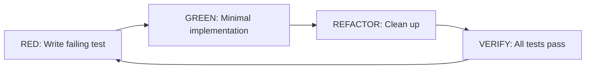

# Development Workflow

## Git Strategy

### Branch Naming Convention

| Type | Pattern | Example |
|------|---------|---------|
| Feature | `feature/<scope>-<description>` | `feature/cqrs-container-registry` |
| Bug fix | `fix/<description>` | `fix/ef-migration-cascade-delete` |
| Documentation | `docs/<description>` | `docs/enterprise-wiki-documentation` |
| Refactoring | `refactor/<description>` | `refactor/bicep-pipeline-stages` |
| Copilot agent | `copilot/<description>` | `copilot/ddd-002-seal-classes` |

### Branch Workflow

```mermaid
gitgraph
    commit id: "main"
    branch feature/new-resource
    commit id: "domain model"
    commit id: "application layer"
    commit id: "infrastructure"
    commit id: "api endpoints"
    commit id: "tests"
    checkout main
    merge feature/new-resource id: "PR merge"
    commit id: "next feature..."
```

### Pull Request Conventions

**Title format:** `type(scope): description`

Examples:
- `feat(domain): add FrontDoor aggregate`
- `fix(bicep): correct container registry role assignment path`
- `refactor(pipeline): extract stage constants`
- `docs(wiki): add onboarding documentation`

**PR must include:**
- Description using the PR template
- All tests passing
- Build successful
- Pre-merge review gate passed

---

## Commit Messages

Follow [Conventional Commits](https://www.conventionalcommits.org/):

```
type(scope): short description

[optional body explaining what and why]

[optional footer: breaking changes, references]
```

| Type | When |
|------|------|
| `feat` | New feature |
| `fix` | Bug fix |
| `refactor` | Code restructuring without behavior change |
| `test` | Adding or fixing tests |
| `docs` | Documentation only |
| `chore` | Build, tooling, dependencies |
| `perf` | Performance improvement |

---

## Code Review Process

1. **Author** creates a PR with descriptive title and filled template
2. **Review Expert** agent performs automated pre-merge review
3. **Vibe Coding Refractaire** agent runs a second anti-vibe pass
4. **Human reviewer** approves or requests changes
5. **Author** addresses feedback
6. **Merge** to main (squash merge recommended)

---

## TDD Workflow (Mandatory)

Every code change follows the **Red → Green → Refactor → Verify** cycle:



1. **RED** — Write a test that describes the expected behavior (it fails)
2. **GREEN** — Write the minimum code to make the test pass
3. **REFACTOR** — Clean up without changing behavior
4. **VERIFY** — Run the full test suite

```powershell
# Run all tests after your change
dotnet test .\InfraFlowSculptor.slnx
```

---

## Build Verification

Before pushing, verify:

```powershell
# Build entire solution
dotnet build .\InfraFlowSculptor.slnx

# Run all tests
dotnet test .\InfraFlowSculptor.slnx

# Frontend type checking
cd src\Front
npm run typecheck
npm run build
cd ..\..
```

---

## Working with Aspire

- Changes to `AppHost.cs` require a restart of Aspire
- Application code (API, MCP, Frontend) hot-reloads automatically
- Use the Aspire Dashboard to inspect traces, logs, and metrics
- PostgreSQL data persists across Aspire restarts (container is persistent)

---

## Common Development Tasks

### Adding a New Feature

1. Create a feature branch
2. Write domain tests first (TDD Red)
3. Implement domain model
4. Write application-layer tests
5. Implement command/query handlers
6. Add FluentValidation validators
7. Wire API endpoints
8. Add contract DTOs
9. Update frontend (if applicable)
10. Verify full test suite

### Debugging

| Tool | Use For |
|------|---------|
| Aspire Dashboard | Distributed traces, structured logs |
| VS Code Debugger | Breakpoints in .NET/Angular |
| DbGate | Database inspection |
| Browser DevTools | Frontend debugging |
| Scalar/Swagger | API endpoint testing |
