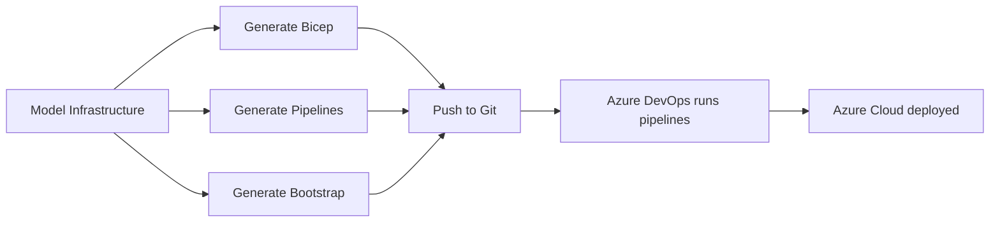

# Project Presentation

## What is InfraFlowSculptor?

**InfraFlowSculptor** is an Azure-first infrastructure modeling platform that enables platform engineering teams to design, validate, and deploy Azure infrastructure through a unified workflow.

### The Problem It Solves

In enterprise Azure environments, teams face:

- **Bicep/ARM complexity** — Writing and maintaining hundreds of Bicep modules manually
- **Pipeline drift** — Azure DevOps pipelines diverging from infrastructure definitions
- **Environment inconsistency** — Dev/staging/prod configurations drifting apart
- **Knowledge silos** — Only senior engineers understand the infrastructure topology
- **Slow onboarding** — New team members need weeks to understand infrastructure patterns

### How InfraFlowSculptor Solves It

InfraFlowSculptor provides a **single source of truth** for:

1. **Infrastructure Modeling** — Define Azure resources, their relationships, and environment-specific settings through a visual UI
2. **Bicep Generation** — Automatically generate production-grade Bicep modules from the model
3. **Pipeline Generation** — Generate Azure DevOps YAML pipelines that deploy the Bicep
4. **Bootstrap Pipelines** — Generate infrastructure bootstrap pipelines for greenfield setups
5. **MCP Integration** — AI agents (GitHub Copilot) can create and manage infrastructure projects conversationally

## Business Objectives

| Objective | Description |
|-----------|-------------|
| **Accelerate delivery** | Reduce infrastructure provisioning from days to minutes |
| **Ensure consistency** | Every environment uses the same validated patterns |
| **Democratize infrastructure** | Junior developers can safely model infrastructure |
| **Enable AI-first workflows** | Copilot/MCP agents drive infrastructure creation |
| **Reduce errors** | Generated artifacts follow enterprise patterns |
| **Audit trail** | All changes tracked through the platform |

## Target Users

| Persona | Usage |
|---------|-------|
| Platform Engineer | Models infrastructure, configures environments |
| DevOps Engineer | Reviews generated pipelines, manages deployment |
| Application Developer | Adds app-specific resources (DBs, caches, messaging) |
| AI Agent (Copilot) | Creates projects from natural language via MCP |
| CTO / Architect | Reviews architecture decisions, audits configurations |

## Key Concepts

### Project

A **Project** is the top-level container. It groups infrastructure configurations, environments, naming conventions, and repository bindings.

### Infrastructure Configuration

An **InfrastructureConfig** represents a logical grouping of Azure resources (e.g., "backend-services", "shared-infra"). A project can have multiple configurations.

### Resource Group

**ResourceGroups** organize Azure resources within a configuration. They map 1:1 to Azure Resource Groups.

### Azure Resources

22 supported Azure resource types (Key Vault, Container App, Storage Account, etc.) with full environment-specific settings, naming, role assignments, and dependency management.

### Environments

Environment definitions (dev, staging, production) drive per-environment Bicep parameter files and pipeline stages.

## Supported Azure Resources

| Category | Resources |
|----------|-----------|
| **Compute** | Container App, Web App, Function App, App Service Plan |
| **Containers** | Container App Environment, Container Registry |
| **Data** | Cosmos DB, SQL Server, SQL Database, Storage Account |
| **Messaging** | Service Bus Namespace, Event Hub Namespace |
| **Caching** | Redis Cache |
| **Configuration** | App Configuration, Key Vault |
| **Identity** | User Assigned Identity |
| **Monitoring** | Application Insights, Log Analytics Workspace |
| **Networking** | Virtual Network, Network Security Group, Private DNS Zone, Front Door |

## License

PolyForm Noncommercial 1.0.0 — source is public for evaluation and noncommercial use; commercial use requires a separate agreement.
