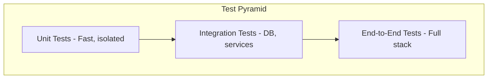

# Testing Guide

## Test Strategy Overview

InfraFlowSculptor uses a **test-first** approach. Every code change must be accompanied by tests.



---

## Test Projects

| Project | Covers | Focus |
|---------|--------|-------|
| `InfraFlowSculptor.Domain.Tests` | Domain aggregates, value objects, entities | Business invariants |
| `InfraFlowSculptor.Application.Tests` | Command/query handlers, validators | Orchestration logic |
| `InfraFlowSculptor.Infrastructure.Tests` | Repositories, EF configurations, services | Data access |
| `InfraFlowSculptor.Api.Tests` | Endpoints, rate limiting, security | HTTP layer |
| `InfraFlowSculptor.BicepGeneration.Tests` | Bicep generators, pipeline stages, IR | Code generation |
| `InfraFlowSculptor.PipelineGeneration.Tests` | Pipeline YAML generation | Pipeline output |
| `InfraFlowSculptor.GenerationCore.Tests` | Shared generation contracts | Boundary guards |
| `InfraFlowSculptor.Contracts.Tests` | Response DTO shapes | API contract stability |
| `InfraFlowSculptor.Mcp.Tests` | MCP tools, drafts, topology | MCP correctness |

---

## Technology Stack

| Library | Purpose |
|---------|---------|
| **xUnit** | Test framework |
| **FluentAssertions** | Readable assertions |
| **NSubstitute** | Mocking |
| **Verify** | Snapshot/approval testing |
| **Bogus** | Fake data generation |
| **MockQueryable** | EF Core `IQueryable` mocking |

---

## Naming Convention

Tests follow the **Given_When_Then** pattern:

```csharp
public class CreateProjectCommandHandlerTests
{
    [Fact]
    public async Task Handle_WithValidCommand_ReturnsProjectResult()
    {
        // Arrange (Given)
        var command = new CreateProjectCommand("My Project");
        
        // Act (When)
        var result = await _sut.Handle(command, CancellationToken.None);
        
        // Assert (Then)
        result.IsError.Should().BeFalse();
        result.Value.Name.Should().Be("My Project");
    }
    
    [Fact]
    public async Task Handle_WithDuplicateName_ReturnsConflictError()
    {
        // ...
    }
}
```

### File Naming

```
tests/
└── InfraFlowSculptor.Domain.Tests/
    └── ProjectAggregate/
        └── ProjectTests.cs          → Tests for Project aggregate
        └── ProjectMemberTests.cs    → Tests for ProjectMember entity
```

---

## Running Tests

```powershell
# All tests
dotnet test .\InfraFlowSculptor.slnx

# Specific project
dotnet test .\tests\InfraFlowSculptor.Domain.Tests\InfraFlowSculptor.Domain.Tests.csproj

# With coverage
dotnet test .\InfraFlowSculptor.slnx --collect:"XPlat Code Coverage"

# Or use the coverage script
.\scripts\test-coverage.ps1

# Filter by test name
dotnet test --filter "FullyQualifiedName~CreateProject"
```

---

## Writing Good Tests

### Do

- ✅ Test one behavior per test method
- ✅ Use descriptive test names
- ✅ Use `_sut` for the System Under Test
- ✅ Follow AAA (Arrange-Act-Assert) pattern
- ✅ Use `FluentAssertions` for all assertions
- ✅ Use `NSubstitute` for mocking dependencies
- ✅ Keep tests deterministic (no random data without seeds)

### Don't

- ❌ Test implementation details
- ❌ Share state between tests
- ❌ Use `Thread.Sleep` or real delays
- ❌ Make tests depend on execution order
- ❌ Mock the class under test
- ❌ Write tests after the production code (TDD is mandatory)

---

## Structural Tests (Convention Guards)

The project uses structural tests to enforce architectural conventions:

| Test | Guards |
|------|--------|
| `AllCommandsHaveValidatorsTests` | Every command has a FluentValidation validator |
| `AggregateFactoryConventionTests` | Aggregates use `Create()` factory pattern |
| `ValueObjectEqualityComponentsCoverageTests` | Value objects have structural equality |
| `CoreStringLengthConfigurationTests` | All string columns have max length |
| `IndexCoverageConfigurationTests` | Key columns have database indexes |
| `ContractsResponseShapeSnapshotTests` | Response DTOs don't change accidentally |
| `RepositoryIncludeHelperConventionTests` | Repositories use shared include helpers |
| `McpProjectTopologyTests` | MCP doesn't reference API directly |
| `GenerationCoreBoundaryTests` | GenerationCore stays contracts-only |

---

## Test Debt Tracking

Detected test debt is recorded in `.github/test-debt.md`. When you add code without full test coverage (exception cases only), document it there with priority (P1-P3).
